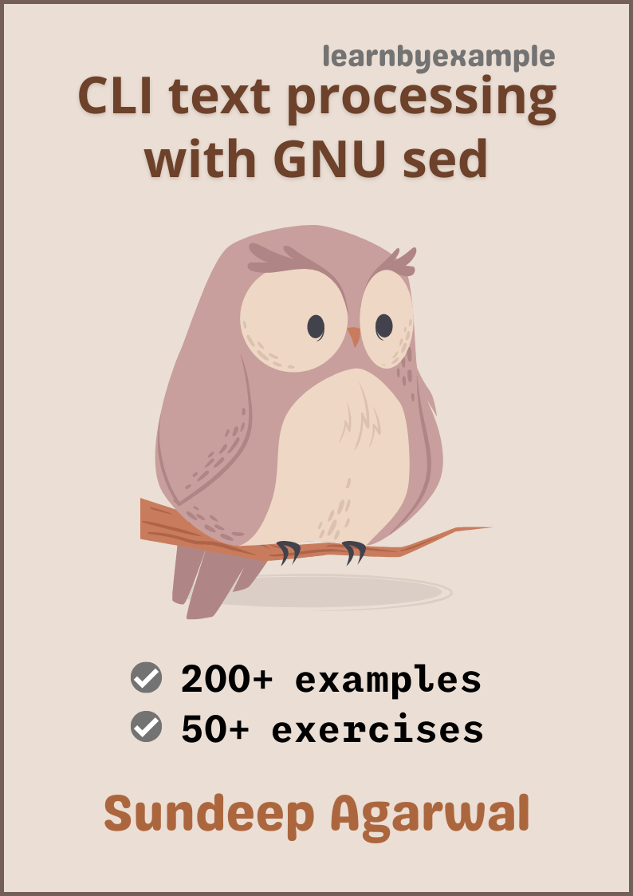

# GNU SED

Example based guide to mastering GNU sed.

    

The book also includes exercises to test your understanding, which is presented together as a single file in this repo - [Exercises.md](./exercises/Exercises.md)

See [Version_changes.md](./Version_changes.md) to keep track of changes made to the book.

 

# E-book

You can purchase the book using these links:

* https://gumroad.com/l/gnu_sed
* https://leanpub.com/gnu_sed
* https://www.instamojo.com/learnbyexample/gnu-sed/

For a preview of the book, see [sample chapters](https://github.com/learnbyexample/learn_gnused/blob/master/sample_chapters/sed_sample_chapters.pdf)

 

# Table of Contents

1) Preface
2) Introduction
3) In-place file editing
4) Selective editing
5) BRE/ERE Regular Expressions
6) Flags
7) Shell substitutions
8) z, s and f command line options
9) append, change, insert
10) Adding content from file
11) Control structures
12) Processing lines bounded by distinct markers
13) Gotchas and Tricks
14) Further Reading

 

# Acknowledgements

* [GNU sed documentation](https://www.gnu.org/software/sed/manual/sed.html) - manual and examples
* [stackoverflow](https://stackoverflow.com/) and [unix.stackexchange](https://unix.stackexchange.com/) - for getting answers to pertinent questions on `bash`, `sed` and other commands
* [tex.stackexchange](https://tex.stackexchange.com/) - for help on `pandoc` and `tex` related questions
* Cover image
    * [draw.io](https://about.draw.io/)
    * [tree icon](https://www.iconfinder.com/icons/3199231/ellipse_green_nature_tree_icon) by [Gopi Doraisamy](https://www.iconfinder.com/gopidoraisamy) under [Creative Commons Attribution 3.0 Unported](https://creativecommons.org/licenses/by/3.0/)
    * [wand icon](https://www.iconfinder.com/icons/1679640/design_magic_magician_tool_wand_icon) by [roundicons.com](https://www.iconfinder.com/roundicons)
* [softwareengineering.stackexchange](https://softwareengineering.stackexchange.com/questions/39/whats-your-favourite-quote-about-programming) and [skolakoda](https://skolakoda.org/programming-quotes) for programming quotes
* [Warning](https://commons.wikimedia.org/wiki/File:Warning_icon.svg) and [Info](https://commons.wikimedia.org/wiki/File:Info_icon_002.svg) icons by [Amada44](https://commons.wikimedia.org/wiki/User:Amada44) under public domain

Special thanks to all my friends and online acquaintances for their help, support and encouragement, especially during difficult times.

 

# License

The code snippets are licensed under MIT, see [LICENSE](./LICENSE) file
