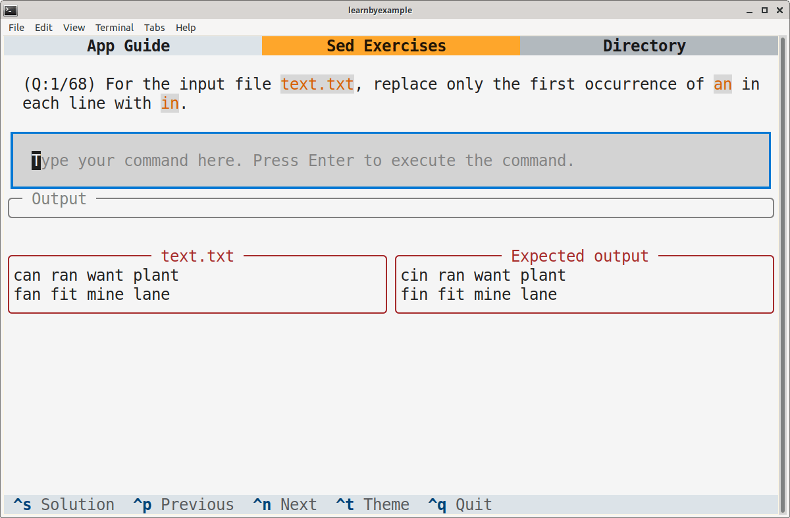

# Preface

You are likely to be familiar with using a search and replace dialog (usually invoked with the `Ctrl+H` shortcut) to locate the occurrences of a particular string and replace it with something else. The `sed` command is a versatile and feature-rich version for search and replace operations, usable from the command line. An important feature that GUI applications may lack is **regular expressions**, a mini-programming language to precisely define a matching criteria.

This book heavily leans on examples to present features one by one. In addition to command options, regular expressions will also be discussed in detail. However, commands to manipulate data buffers and multiline techniques will be discussed only briefly and some commands are skipped entirely.

It is recommended that you manually type each example. Make an effort to understand the sample input as well as the solution presented and check if the output changes (or not!) when you alter some part of the input and the command. As an analogy, consider learning to drive a car — no matter how much you read about them or listen to explanations, you'd need practical experience to become proficient.

## Prerequisites

You should be familiar with command line usage in a Unix-like environment. You should also be comfortable with concepts like file redirection and command pipelines. Knowing the basics of the `grep` command will be handy in understanding the filtering features of `sed`.

If you are new to the world of the command line, check out my [Computing from the Command Line](https://github.com/learnbyexample/cli-computing) ebook and curated resources on [Linux CLI and Shell scripting](https://learnbyexample.github.io/curated_resources/linux_cli_scripting.html) before starting this book.

## Conventions

* The examples presented here have been tested with **GNU sed** version **4.9** and may include features not available in earlier versions.
* Code snippets are copy pasted from the `GNU bash` shell and modified for presentation purposes. Some commands are preceded by comments to provide context and explanations. Blank lines to improve readability, only `real` time shown for speed comparisons, output skipped for commands like `wget` and so on.
* Unless otherwise noted, all examples and explanations are meant for **ASCII** input.
* `sed` would mean `GNU sed`, `grep` would mean `GNU grep` and so on unless otherwise specified.
* External links are provided throughout the book for you to explore certain topics in more depth.
* The [learn_gnused repo](https://github.com/learnbyexample/learn_gnused) has all the code snippets and files used in examples, exercises and other details related to the book. If you are not familiar with the `git` command, click the **Code** button on the webpage to get the files.

## Acknowledgements

* [GNU sed documentation](https://www.gnu.org/software/sed/manual/sed.html) — manual and examples
* [stackoverflow](https://stackoverflow.com/) and [unix.stackexchange](https://unix.stackexchange.com/) — for getting answers to pertinent questions on `sed` and related commands
* [tex.stackexchange](https://tex.stackexchange.com/) — for help on [pandoc](https://github.com/jgm/pandoc/) and `tex` related questions
* [/r/commandline/](https://old.reddit.com/r/commandline), [/r/linux4noobs/](https://old.reddit.com/r/linux4noobs/), [/r/linuxquestions/](https://old.reddit.com/r/linuxquestions/) and [/r/linux/](https://old.reddit.com/r/linux/) — helpful forums
* [canva](https://www.canva.com/) — cover image
* [oxipng](https://github.com/shssoichiro/oxipng), [pngquant](https://pngquant.org/) and [svgcleaner](https://github.com/RazrFalcon/svgcleaner) — optimizing images
* [Warning](https://commons.wikimedia.org/wiki/File:Warning_icon.svg) and [Info](https://commons.wikimedia.org/wiki/File:Info_icon_002.svg) icons by [Amada44](https://commons.wikimedia.org/wiki/User:Amada44) under public domain
* [arifmahmudrana](https://github.com/arifmahmudrana) for spotting an ambiguous explanation

Special thanks to all my friends and online acquaintances for their help, support and encouragement, especially during difficult times.

## Feedback and Errata

I would highly appreciate it if you'd let me know how you felt about this book. It could be anything from a simple thank you, pointing out a typo, mistakes in code snippets, which aspects of the book worked for you (or didn't!) and so on. Reader feedback is essential and especially so for self-published authors.

You can reach me via:

* Issue Manager: [https://github.com/learnbyexample/learn_gnused/issues](https://github.com/learnbyexample/learn_gnused/issues)
* E-mail: learnbyexample.net@gmail.com
* Twitter: [https://twitter.com/learn_byexample](https://twitter.com/learn_byexample)

## Author info

Sundeep Agarwal is a lazy being who prefers to work just enough to support his modest lifestyle. He accumulated vast wealth working as a Design Engineer at Analog Devices and retired from the corporate world at the ripe age of twenty-eight. Unfortunately, he squandered his savings within a few years and had to scramble trying to earn a living. Against all odds, selling programming ebooks saved his lazy self from having to look for a job again. He can now afford all the fantasy ebooks he wants to read and spends unhealthy amount of time browsing the internet.

When the creative muse strikes, he can be found working on yet another programming ebook (which invariably ends up having at least one example with regular expressions). Researching materials for his ebooks and everyday social media usage drowned his bookmarks, so he maintains curated resource lists for sanity sake. He is thankful for free learning resources and open source tools. His own contributions can be found at [https://github.com/learnbyexample](https://github.com/learnbyexample).

**List of books:** https://learnbyexample.github.io/books/

## License

This work is licensed under a [Creative Commons Attribution-NonCommercial-ShareAlike 4.0 International License](https://creativecommons.org/licenses/by-nc-sa/4.0/).

Code snippets are available under [MIT License](https://github.com/learnbyexample/learn_gnused/blob/master/LICENSE).

Resources mentioned in Acknowledgements section above are available under original licenses.

## Book version

2.0

See [Version_changes.md](https://github.com/learnbyexample/learn_gnused/blob/master/Version_changes.md) to track changes across book versions.

# Introduction

The command name `sed` is derived from **s**tream **ed**itor. Here, stream refers to data being passed via shell pipes. Thus, the command's primary functionality is to act as a text editor for **stdin** data with **stdout** as the output target. It is now common to use `sed` on file inputs as well as in-place file editing.

This chapter will show how to install the latest `sed` version followed by details related to documentation. Then, you'll get an introduction to the **substitute** command, which is the most commonly used feature. The chapters to follow will add more details to the substitute command, discuss other commands and command line options. Cheatsheet, summary and exercises are also included at the end of these chapters.

## Installation

If you are on a Unix-like system, you will most likely have some version of `sed` already installed. This book is primarily about `GNU sed`. As there are syntax and feature differences between various implementations, make sure to use `GNU sed` to follow along the examples presented in this book.

`GNU sed` is part of the [text creation and manipulation](https://www.gnu.org/manual/manual.html) tools and comes by default on GNU/Linux distributions. To install a particular version, visit [gnu: sed software](https://www.gnu.org/software/sed/). See also [release notes](https://savannah.gnu.org/news/?group=sed) for an overview of changes between versions and [bug list](https://debbugs.gnu.org/cgi/pkgreport.cgi?package=sed) if you think some command isn't working as expected.

```bash
$ wget https://ftp.gnu.org/gnu/sed/sed-4.9.tar.xz
$ tar -Jxf sed-4.9.tar.xz
$ cd sed-4.9/
# see https://askubuntu.com/q/237576 if you get compiler not found error
$ ./configure
$ make
$ sudo make install

$ sed --version | head -n1
sed (GNU sed) 4.9
```

If you are not using a Linux distribution, you may be able to access `GNU sed` using an option below:

* [Git for Windows](https://git-scm.com/downloads) — provides a Bash emulation used to run Git from the command line
* [Windows Subsystem for Linux](https://en.wikipedia.org/wiki/Windows_Subsystem_for_Linux) — compatibility layer for running Linux binary executables natively on Windows
* [brew](https://brew.sh/) — Package Manager for macOS (or Linux)

## Documentation

It is always good to know where to find documentation. From the command line, you can use `man sed` for a short manual and `info sed` for the full documentation. I prefer using the [online gnu sed manual](https://www.gnu.org/software/sed/manual/sed.html), which feels much easier to use and navigate.

```bash
$ man sed
SED(1)                          User Commands                         SED(1)  

NAME
       sed - stream editor for filtering and transforming text

SYNOPSIS
       sed [-V] [--version] [--help] [-n] [--quiet] [--silent]
           [-l N] [--line-length=N] [-u] [--unbuffered]
           [-E] [-r] [--regexp-extended]
           [-e script] [--expression=script]
           [-f script-file] [--file=script-file]
           [script-if-no-other-script]
           [file...]

DESCRIPTION
       Sed  is  a  stream  editor.  A stream editor is used to perform basic
       text transformations on an input stream (a file or input from a pipe‐
       line).   While  in  some  ways  similar  to  an  editor which permits
       scripted edits (such as ed), sed works by making only one  pass  over
       the  input(s),  and  is consequently more efficient.  But it is sed's
       ability to filter text in a pipeline which particularly distinguishes
       it from other types of editors.
```

## Options overview

For a quick overview of all the available options, use `sed --help` from the command line.

```bash
# only partial output shown here
$ sed --help
  -n, --quiet, --silent
                 suppress automatic printing of pattern space
      --debug
                 annotate program execution
  -e script, --expression=script
                 add the script to the commands to be executed
  -f script-file, --file=script-file
                 add the contents of script-file to the commands to be executed
  --follow-symlinks
                 follow symlinks when processing in place
  -i[SUFFIX], --in-place[=SUFFIX]
                 edit files in place (makes backup if SUFFIX supplied)
  -l N, --line-length=N
                 specify the desired line-wrap length for the 'l' command
  --posix
                 disable all GNU extensions.
  -E, -r, --regexp-extended
                 use extended regular expressions in the script
                 (for portability use POSIX -E).
  -s, --separate
                 consider files as separate rather than as a single,
                 continuous long stream.
      --sandbox
                 operate in sandbox mode (disable e/r/w commands).
  -u, --unbuffered
                 load minimal amounts of data from the input files and flush
                 the output buffers more often
  -z, --null-data
                 separate lines by NUL characters
      --help     display this help and exit
      --version  output version information and exit

If no -e, --expression, -f, or --file option is given, then the first
non-option argument is taken as the sed script to interpret.  All
remaining arguments are names of input files; if no input files are
specified, then the standard input is read.
```

## Editing standard input

`sed` has various commands to manipulate text. The **substitute** command is the most commonly used operation, helps to replace matching text with something else. The syntax is `s/REGEXP/REPLACEMENT/FLAGS` where

* `s` stands for the **substitute** command
* `/` is an idiomatic delimiter character to separate various portions of the command
* `REGEXP` stands for **regular expression**
* `REPLACEMENT` refers to the replacement string
* `FLAGS` are options to change the default behavior of the command

For now, it is enough to know that the `s` command is used for search and replace operations.

```bash
# input data that'll be passed to sed for editing
$ printf '1,2,3,4\na,b,c,d\n'
1,2,3,4
a,b,c,d

# for each input line, change only the first ',' to '-'
$ printf '1,2,3,4\na,b,c,d\n' | sed 's/,/-/'
1-2,3,4
a-b,c,d

# change all matches by adding the 'g' flag
$ printf '1,2,3,4\na,b,c,d\n' | sed 's/,/-/g'
1-2-3-4
a-b-c-d
```

In the above example, the input data is created using the `printf` command to showcase stream editing. By default, `sed` processes the input line by line. The newline character `\n` is the line separator by default. The first `sed` command replaces only the first occurrence of `,` with `-`. The second command replaces all occurrences as the `g` flag is also used (`g` stands for `global`).

> As a good practice, always use single quotes around the script argument. Examples requiring shell interpretation will be discussed later.

> If your input file has `\r\n` (carriage return and newline characters) as the line ending, convert the input file to Unix-style before processing. See [stackoverflow: Why does my tool output overwrite itself and how do I fix it?](https://stackoverflow.com/q/45772525/4082052) for a detailed discussion and mitigation methods.
> 
> ```bash
> # Unix style
> $ printf '42\n' | file -
> /dev/stdin: ASCII text
> 
> # DOS style
> $ printf '42\r\n' | file -
> /dev/stdin: ASCII text, with CRLF line terminators
> ```

## Editing file input

Although `sed` derives its name from *stream editing*, it is common to use `sed` for file editing. To do so, you can pass one or more input filenames as arguments. You can use `-` to represent stdin as one of the input sources. By default, the modified data will go to the `stdout` stream and the input files are not modified. [In-place file editing](#in-place-file-editing) chapter will discuss how to apply the changes back to the source file(s).

> The [example_files](https://github.com/learnbyexample/learn_gnused/tree/master/example_files) directory has all the files used in the examples.

```bash
$ cat greeting.txt
Hi there
Have a nice day

# for each line, change the first occurrence of 'day' with 'weekend'
$ sed 's/day/weekend/' greeting.txt
Hi there
Have a nice weekend

# change all occurrences of 'e' to 'E'
# redirect modified data to another file
$ sed 's/e/E/g' greeting.txt > out.txt
$ cat out.txt
Hi thErE
HavE a nicE day
```

In the previous section examples, every input line had matched the search expression. The first `sed` command here searched for `day`, which did not match the first line of `greeting.txt` file. By default, even if a line doesn't satisfy the search expression, it will be part of the output. You'll see how to get only the modified lines in the [Print command](#print-command) section.

## Cheatsheet and summary

| Note                     | Description    |
| ------------------------ | -------------- |
| `man sed` | brief manual |
| `sed --help` | brief description of all the command line options |
| `info sed` | comprehensive manual |
| [online gnu sed manual](https://www.gnu.org/software/sed/manual/sed.html) | well formatted, easier to read and navigate |
| `s/REGEXP/REPLACEMENT/FLAGS` | syntax for the substitute command |
| `sed 's/,/-/'` | for each line, replace first `,` with `-` |
| `sed 's/,/-/g'` | replace all `,` with `-` |

This introductory chapter covered installation process, documentation and how to search and replace text using `sed` from the command line. In the coming chapters, you'll learn many more commands and features that make `sed` an important tool when it comes to command line text processing. One such feature is editing files in-place, which will be discussed in the next chapter.

## Interactive exercises

I wrote a TUI app to help you solve some of the exercises from this book interactively. See [SedExercises](https://github.com/learnbyexample/TUI-apps/tree/main/SedExercises) repo for installation steps and [app_guide.md](https://github.com/learnbyexample/TUI-apps/blob/main/SedExercises/app_guide.md) for instructions on using this app.

Here's a sample screenshot:



## Exercises

> All the exercises are also collated together in one place at [Exercises.md](https://github.com/learnbyexample/learn_gnused/blob/master/exercises/Exercises.md). For solutions, see [Exercise_solutions.md](https://github.com/learnbyexample/learn_gnused/blob/master/exercises/Exercise_solutions.md).

> The [exercises](https://github.com/learnbyexample/learn_gnused/tree/master/exercises) directory has all the files used in this section.

**1)** Replace only the first occurrence of `5` with `five` for the given stdin source.

```bash
$ echo 'They ate 5 apples and 5 mangoes' | sed ##### add your solution here
They ate five apples and 5 mangoes
```

**2)** Replace all occurrences of `5` with `five`.

```bash
$ echo 'They ate 5 apples and 5 mangoes' | sed ##### add your solution here
They ate five apples and five mangoes
```

**3)** Replace all occurrences of `0xA0` with `0x50` and `0xFF` with `0x7F` for the given input file.

```bash
$ cat hex.txt
start address: 0xA0, func1 address: 0xA0
end address: 0xFF, func2 address: 0xB0

$ sed ##### add your solution here
start address: 0x50, func1 address: 0x50
end address: 0x7F, func2 address: 0xB0
```

**4)** The substitute command searches and replaces sequences of characters. When you need to map one or more characters with another set of corresponding characters, you can use the `y` command. Quoting from the manual:

>**y/src/dst/** Transliterate any characters in the pattern space which match any of the source-chars with the corresponding character in dest-chars.

Use the `y` command to transform the given input string to get the output string as shown below.

```bash
$ echo 'goal new user sit eat dinner' | sed ##### add your solution here
gOAl nEw UsEr sIt EAt dInnEr
```

**5)** Why does the following command produce an error? How'd you fix it?

```bash
$ echo 'a sunny day' | sed s/sunny day/cloudy day/
sed: -e expression #1, char 7: unterminated `s' command

# expected output
$ echo 'a sunny day' | sed ##### add your solution here
a cloudy day
```

# In-place file editing

In the examples presented so far, the output from `sed` was displayed on the terminal or redirected to another file. This chapter will discuss how to write back the changes to the input files using the `-i` command line option. This option can be configured to make changes to the input files with or without creating a backup of original contents. When backups are needed, the original filename can get a prefix or a suffix or both. And the backups can be placed in the same directory or some other directory as needed.

> The [example_files](https://github.com/learnbyexample/learn_gnused/tree/master/example_files) directory has all the files used in the examples.

## With backup

When an extension is provided as an argument to the `-i` option, the original contents of the input file gets preserved as per the extension given. For example, if the input file is `ip.txt` and `-i.orig` is used, the backup file will be named as `ip.txt.orig`.

```bash
$ cat colors.txt
deep blue
light orange
blue delight

# no output on terminal as -i option is used
# space is NOT allowed between -i and the extension
$ sed -i.bkp 's/blue/green/' colors.txt
# output from sed is written back to 'colors.txt'
$ cat colors.txt
deep green
light orange
green delight

# original file is preserved in 'colors.txt.bkp'
$ cat colors.txt.bkp
deep blue
light orange
blue delight
```

## Without backup

Sometimes backups are not desirable. In such cases, you can use the `-i` option without an argument. Be careful though, as changes made cannot be undone. It is recommended to test the command with sample inputs before applying the `-i` option on the actual file. You could also use the option with backup, compare the differences with a `diff` program and then delete the backup.

```bash
$ cat fruits.txt
banana
papaya
mango

$ sed -i 's/an/AN/g' fruits.txt
$ cat fruits.txt
bANANa
papaya
mANgo
```

## Multiple files

Multiple input files are treated individually and the changes are written back to respective files.

```bash
$ cat f1.txt
have a nice day
bad morning
what a pleasant evening
$ cat f2.txt
worse than ever
too bad

$ sed -i.bkp 's/bad/good/' f1.txt f2.txt
$ ls f?.*
f1.txt  f1.txt.bkp  f2.txt  f2.txt.bkp

$ cat f1.txt
have a nice day
good morning
what a pleasant evening
$ cat f2.txt
worse than ever
too good
```

## Prefix backup name

A `*` character in the argument to the `-i` option is special. It will get replaced with the input filename. This is helpful if you need to use a prefix instead of a suffix for the backup filename. Or any other combination that may be needed.

```bash
$ ls *colors*
colors.txt  colors.txt.bkp

# single quotes is used here as * is a special shell character
$ sed -i'bkp.*' 's/green/yellow/' colors.txt

$ ls *colors*
bkp.colors.txt  colors.txt  colors.txt.bkp
```

## Place backups in a different directory

The `*` trick can also be used to place the backups in another directory instead of the parent directory of input files. The backup directory should already exist for this to work.

```bash
$ mkdir backups
$ sed -i'backups/*' 's/good/nice/' f1.txt f2.txt
$ ls backups/
f1.txt  f2.txt
```

## Cheatsheet and summary

| Note                     | Description    |
| ------------------------ | -------------- |
| `-i` | after processing, write back changes to the source file(s) |
| | changes made cannot be undone, so use this option with caution |
| `-i.bkp` | in addition to in-place editing, preserve original contents to a file |
| | whose name is derived from the input filename and `.bkp` as a suffix |
| `-i'bkp.*'` | `*` here gets replaced with the input filename |
| | thus providing a way to add a prefix instead of a suffix |
| `-i'backups/*'` | this will place the backup copy in a different existing directory |
| | instead of source directory |

This chapter discussed about the `-i` option which is useful when you need to edit a file in-place. This is particularly useful in automation scripts. But, do ensure that you have tested the `sed` command before applying to actual files if you need to use this option without creating backups. In the next chapter, you'll learn filtering features of `sed` and how that helps to apply commands to only certain input lines instead of all the lines.

## Exercises

> The [exercises](https://github.com/learnbyexample/learn_gnused/tree/master/exercises) directory has all the files used in this section.

**1)** For the input file `text.txt`, replace all occurrences of `in` with `an` and write back the changes to `text.txt` itself. The original contents should get saved to `text.txt.orig`

```bash
$ cat text.txt
can ran want plant
tin fin fit mine line
$ sed ##### add your solution here

$ cat text.txt
can ran want plant
tan fan fit mane lane
$ cat text.txt.orig
can ran want plant
tin fin fit mine line
```

**2)** For the input file `text.txt`, replace all occurrences of `an` with `in` and write back the changes to `text.txt` itself. Do not create backups for this exercise. Note that you should have solved the previous exercise before starting this one.

```bash
$ cat text.txt
can ran want plant
tan fan fit mane lane
$ sed ##### add your solution here

$ cat text.txt
cin rin wint plint
tin fin fit mine line
$ diff text.txt text.txt.orig
1c1
< cin rin wint plint
---
> can ran want plant
```

**3)** For the input file `copyright.txt`, replace `copyright: 2018` with `copyright: 2019` and write back the changes to `copyright.txt` itself. The original contents should get saved to `2018_copyright.txt.bkp`

```bash
$ cat copyright.txt
bla bla 2015 bla
blah 2018 blah
bla bla bla
copyright: 2018
$ sed ##### add your solution here

$ cat copyright.txt
bla bla 2015 bla
blah 2018 blah
bla bla bla
copyright: 2019
$ cat 2018_copyright.txt.bkp
bla bla 2015 bla
blah 2018 blah
bla bla bla
copyright: 2018
```

**4)** In the code sample shown below, two files are created by redirecting the output of the `echo` command. Then a `sed` command is used to edit `b1.txt` in-place as well as create a backup named `bkp.b1.txt`. Will the `sed` command work as expected? If not, why?

```bash
$ echo '2 apples' > b1.txt
$ echo '5 bananas' > -ibkp.txt
$ sed -ibkp.* 's/2/two/' b1.txt
```

**5)** For the input file `pets.txt`, remove the first occurrence of `I like ` from each line and write back the changes to `pets.txt` itself. The original contents should get saved with the same filename inside the `bkp` directory. Assume that you do not know whether `bkp` exists or not in the current working directory.

```bash
$ cat pets.txt
I like cats
I like parrots
I like dogs

##### add your solution here

$ cat pets.txt
cats
parrots
dogs
$ cat bkp/pets.txt
I like cats
I like parrots
I like dogs
```

# Selective editing

By default, `sed` acts on the entire input content. Many a times, you want to act only upon specific portions of the input. To that end, `sed` has features to filter lines, similar to tools like `grep`, `head` and `tail`. `sed` can replicate most of `grep`'s filtering features without too much fuss. And has additional features like line number based filtering, selecting lines between two patterns, relative addressing, etc. If you are familiar with functional programming, you would have come across the **map, filter, reduce** paradigm. A typical task with `sed` involves filtering a subset of input and then modifying (mapping) them. Sometimes, the subset is the entire input, as seen in the examples of previous chapters.

> A tool optimized for a particular functionality should be preferred where possible. `grep`, `head` and `tail` would be better performance wise compared to `sed` for equivalent line filtering solutions.

> The [example_files](https://github.com/learnbyexample/learn_gnused/tree/master/example_files) directory has all the files used in the examples.

## REGEXP filtering

As seen earlier, syntax for the substitute command is `s/REGEXP/REPLACEMENT/FLAGS`. The `/REGEXP/FLAGS` portion can be used as a conditional expression to allow commands to execute only for the lines matching the pattern.

```bash
# change commas to hyphens only if the input line contains '2'
# space between the filter and the command is optional
$ printf '1,2,3,4\na,b,c,d\n' | sed '/2/ s/,/-/g'
1-2-3-4
a,b,c,d
```

Use `/REGEXP/FLAGS!` to act upon lines other than the matching ones.

```bash
# change commas to hyphens if the input line does NOT contain '2'
# space around ! is optional
$ printf '1,2,3,4\na,b,c,d\n' | sed '/2/! s/,/-/g'
1,2,3,4
a-b-c-d
```

`/REGEXP/` is one of the ways to define a filter, termed as **address** in the manual. Others will be covered later in this chapter.

> Regular expressions will be discussed [later](#breere-regular-expressions). In this chapter, the examples with `/REGEXP/` filtering will use only fixed strings (exact string comparison).

## Delete command

To **d**elete the filtered lines, use the `d` command. Recall that all input lines are printed by default.

```bash
# same as: grep -v 'at'
$ printf 'sea\neat\ndrop\n' | sed '/at/d'
sea
drop
```

To get the default `grep` filtering, use the `!d` combination. Sometimes, negative logic can get confusing to use. It boils down to personal preference, similar to choosing between `if` and `unless` conditionals in programming languages.

```bash
# same as: grep 'at'
$ printf 'sea\neat\ndrop\n' | sed '/at/!d'
eat
```

> Using an **address** is optional. So, for example, `sed '!d' file` would be equivalent to the `cat file` command.
>
> ```bash
> # same as: cat greeting.txt
> $ sed '!d' greeting.txt
> Hi there
> Have a nice day
> ```

## Print command

To **p**rint the filtered lines, use the `p` command. But, recall that all input lines are printed by default. So, this command is typically used in combination with the `-n` option, which would turn off the default printing.

```bash
$ cat rhymes.txt
it is a warm and cozy day
listen to what I say
go play in the park
come back before the sky turns dark

There are so many delights to cherish
Apple, Banana and Cherry
Bread, Butter and Jelly
Try them all before you perish

# same as: grep 'warm' rhymes.txt
$ sed -n '/warm/p' rhymes.txt
it is a warm and cozy day

# same as: grep 'n t' rhymes.txt
$ sed -n '/n t/p' rhymes.txt
listen to what I say
go play in the park
```

The substitute command provides `p` as a flag. In such a case, the modified line would be printed only if the substitution succeeded.

```bash
$ sed -n 's/warm/cool/gp' rhymes.txt
it is a cool and cozy day

# filter + substitution + p combination
$ sed -n '/the/ s/ark/ARK/gp' rhymes.txt
go play in the pARK
come back before the sky turns dARK
```

Using `!p` with the `-n` option will be equivalent to using the `d` command.

```bash
# same as: sed '/at/d'
$ printf 'sea\neat\ndrop\n' | sed -n '/at/!p'
sea
drop
```

Here's an example of using the `p` command without the `-n` option.

```bash
# duplicate every line
$ seq 2 | sed 'p'
1
1
2
2
```

## Quit commands

The `q` command causes `sed` to exit immediately. Remaining commands and input lines will not be processed.

```bash
# quits after an input line containing 'say' is found
$ sed '/say/q' rhymes.txt
it is a warm and cozy day
listen to what I say
```

The `Q` command is similar to `q` but won't print the matching line.

```bash
# matching line won't be printed
$ sed '/say/Q' rhymes.txt
it is a warm and cozy day
```

Use `tac` to get all lines starting from the last occurrence of the search string in the entire file.

```bash
$ tac rhymes.txt | sed '/an/q' | tac
Bread, Butter and Jelly
Try them all before you perish
```

You can optionally provide an exit status (from `0` to `255`) along with the quit commands.

```bash
$ printf 'sea\neat\ndrop\n' | sed '/at/q2'
sea
eat
$ echo $?
2

$ printf 'sea\neat\ndrop\n' | sed '/at/Q3'
sea
$ echo $?
3
```

> Be careful if you want to use `q` or `Q` commands with multiple files, as `sed` will stop even if there are other files remaining to be processed. You could use a [mixed address range](#address-range) as a workaround. See also [unix.stackexchange: applying q to multiple files](https://unix.stackexchange.com/q/309514/109046).

## Multiple commands

Commands seen so far can be specified more than once by separating them using `;` or using the `-e` option multiple times. See [sed manual: Multiple commands syntax](https://www.gnu.org/software/sed/manual/sed.html#Multiple-commands-syntax) for more details.

```bash
# print all input lines as well as the modified lines
$ printf 'sea\neat\ndrop\n' | sed -n -e 'p' -e 's/at/AT/p'
sea
eat
eAT
drop

# equivalent command to the above example using ; instead of -e
# space around ; is optional
$ printf 'sea\neat\ndrop\n' | sed -n 'p; s/at/AT/p'
sea
eat
eAT
drop
```

You can also separate the commands using a literal newline character. If many lines are needed, it is better to use a [sed script](#file-as-the-source-of-sed-commands) instead.

```bash
# here, each command is separated by a literal newline character
# similar to $ representing the primary prompt PS1,
# > represents the secondary prompt PS2
$ sed -n '
> /the/ s/ark/ARK/gp
> s/warm/cool/gp
> s/Bread/Cake/gp
> ' rhymes.txt
it is a cool and cozy day
go play in the pARK
come back before the sky turns dARK
Cake, Butter and Jelly
```

> Do not use multiple commands to construct conditional OR of multiple search strings, as you might get lines duplicated in the output as shown below. You can use regular expression feature [alternation](#alternation) for such cases.
> 
> ```bash
> $ sed -ne '/play/p' -e '/ark/p' rhymes.txt
> go play in the park
> go play in the park
> come back before the sky turns dark
> ```

To execute multiple commands for a common filter, use `{}` to group the commands. You can also nest them if needed.

```bash
# spaces around {} is optional
$ printf 'gates\nnot\nused\n' | sed '/e/{s/s/*/g; s/t/*/g}'
ga*e*
not
u*ed

$ sed -n '/the/{s/for/FOR/gp; /play/{p; s/park/PARK/gp}}' rhymes.txt
go play in the park
go play in the PARK
come back beFORe the sky turns dark
Try them all beFORe you perish
```

Command grouping is an easy way to construct conditional AND of multiple search strings.

```bash
# same as: grep 'ark' rhymes.txt | grep 'play'
$ sed -n '/ark/{/play/p}' rhymes.txt
go play in the park

# same as: grep 'the' rhymes.txt | grep 'for' | grep 'urn'
$ sed -n '/the/{/for/{/urn/p}}' rhymes.txt
come back before the sky turns dark

# same as: grep 'for' rhymes.txt | grep -v 'sky'
$ sed -n '/for/{/sky/!p}' rhymes.txt
Try them all before you perish
```

Other solutions using alternation feature of regular expressions and `sed`'s [control structures](#control-structures) will be discussed later.

## Line addressing

Line numbers can also be used as a filtering criteria.

```bash
# here, 3 represents the address for the print command
# same as: head -n3 rhymes.txt | tail -n1
# same as: sed '3!d'
$ sed -n '3p' rhymes.txt
go play in the park

# print 2nd and 6th line
$ sed -n '2p; 6p' rhymes.txt
listen to what I say
There are so many delights to cherish

# apply substitution only for the 2nd line
$ printf 'gates\nnot\nused\n' | sed '2 s/t/*/g'
gates
no*
used
```

As a special case, `$` indicates the last line of the input.

```bash
# same as: tail -n1 rhymes.txt
$ sed -n '$p' rhymes.txt
Try them all before you perish
```

For large input files, use the `q` command to avoid processing unnecessary input lines.

```bash
$ seq 3542 4623452 | sed -n '2452{p; q}'
5993
$ seq 3542 4623452 | sed -n '250p; 2452{p; q}'
3791
5993

# here is a sample time comparison
$ time seq 3542 4623452 | sed -n '2452{p; q}' > f1
real    0m0.005s
$ time seq 3542 4623452 | sed -n '2452p' > f2
real    0m0.121s
$ rm f1 f2
```

Mimicking the `head` command using line number addressing and the `q` command.

```bash
# same as: seq 23 45 | head -n5
$ seq 23 45 | sed '5q'
23
24
25
26
27
```

## Print only the line number

The `=` command will display the line numbers of matching lines.

```bash
# gives both the line number and matching lines
$ grep -n 'the' rhymes.txt
3:go play in the park
4:come back before the sky turns dark
9:Try them all before you perish

# gives only the line number of matching lines
# note the use of the -n option to avoid default printing
$ sed -n '/the/=' rhymes.txt
3
4
9
```

If needed, matching line can also be printed. But there will be a newline character between the matching line and the line number.

```bash
$ sed -n '/what/{=; p}' rhymes.txt
2
listen to what I say

$ sed -n '/what/{p; =}' rhymes.txt
listen to what I say
2
```

## Address range

So far, filtering has been based on specific line number or lines matching the given REGEXP pattern. Address range gives the ability to define a starting address and an ending address separated by a comma.

```bash
# note that all the matching ranges are printed
$ sed -n '/to/,/pl/p' rhymes.txt
listen to what I say
go play in the park
There are so many delights to cherish
Apple, Banana and Cherry

# same as: sed -n '3,8!p'
$ seq 15 24 | sed '3,8d'
15
16
23
24
```

Line numbers and REGEXP filtering can be mixed.

```bash
$ sed -n '6,/utter/p' rhymes.txt
There are so many delights to cherish
Apple, Banana and Cherry
Bread, Butter and Jelly

# same as: sed '/play/Q' rhymes.txt
# inefficient, but this will work for multiple file inputs
$ sed '/play/,$d' rhymes.txt
it is a warm and cozy day
listen to what I say
```

If the second filtering condition doesn't match, lines starting from the first condition to the last line of the input will be matched.

```bash
# there's a line containing 'Banana' but the matching pair isn't found
$ sed -n '/Banana/,/XYZ/p' rhymes.txt
Apple, Banana and Cherry
Bread, Butter and Jelly
Try them all before you perish
```

The second address will always be used as a filtering condition only from the line that comes after the line that satisfied the first address. For example, if the same search pattern is used for both the addresses, there'll be at least two lines in output (assuming there are lines in the input after the first matching line).

```bash
$ sed -n '/w/,/w/p' rhymes.txt
it is a warm and cozy day
listen to what I say

# there's no line containing 'Cherry' after the 7th line
# so, rest of the file gets printed
$ sed -n '7,/Cherry/p' rhymes.txt
Apple, Banana and Cherry
Bread, Butter and Jelly
Try them all before you perish
```

As a special case, the first address can be `0` if the second one is a REGEXP filter. This allows the search pattern to be matched against the first line of the file.

```bash
# same as: sed '/cozy/q'
# inefficient, but this will work for multiple file inputs
$ sed -n '0,/cozy/p' rhymes.txt
it is a warm and cozy day

# same as: sed '/say/q'
$ sed -n '0,/say/p' rhymes.txt
it is a warm and cozy day
listen to what I say
```

## Relative addressing

The `grep` command has an option `-A` that allows you to view lines that come *after* the matching lines. The `sed` command provides a similar feature when you prefix a `+` character to the number used in the second address. One difference compared to `grep` is that the context lines won't trigger a fresh matching of the first address.

```bash
# match a line containing 'the' and display the next line as well
# won't be same as: grep -A1 --no-group-separator 'the'
$ sed -n '/the/,+1p' rhymes.txt
go play in the park
come back before the sky turns dark
Try them all before you perish

# the first address can be a line number too
# helpful when it is programmatically constructed in a script
$ sed -n '6,+2p' rhymes.txt
There are so many delights to cherish
Apple, Banana and Cherry
Bread, Butter and Jelly
```

You can construct an arithmetic progression with start and step values separated by the `~` symbol. `i~j` will filter lines numbered `i+0j`, `i+1j`, `i+2j`, `i+3j`, etc. So, `1~2` means all odd numbered lines and `5~3` means 5th, 8th, 11th, etc.

```bash
# print even numbered lines
$ seq 10 | sed -n '2~2p'
2
4
6
8
10

# delete lines numbered 2+0*4, 2+1*4, 2+2*4, etc (2, 6, 10, etc)
$ seq 7 | sed '2~4d'
1
3
4
5
7
```

If `i,~j` is used (note the `,`) then the meaning changes completely. After the start address, the closest line number which is a multiple of `j` will mark the end address. The start address can be REGEXP based filtering as well.

```bash
# here, closest multiple of 4 is the 4th line
$ seq 10 | sed -n '2,~4p'
2
3
4
# here, closest multiple of 4 is the 8th line
$ seq 10 | sed -n '5,~4p'
5
6
7
8

# line matching 'many' is the 6th line, closest multiple of 3 is the 9th line
$ sed -n '/many/,~3p' rhymes.txt
There are so many delights to cherish
Apple, Banana and Cherry
Bread, Butter and Jelly
Try them all before you perish
```

## n and N commands

So far, the commands used have all been processing only one line at a time. The address range option provides the ability to act upon a group of lines, but the commands still operate one line at a time for that group. There are cases when you want a command to handle a string that contains multiple lines. As mentioned in the preface, this book will not cover advanced commands related to multiline processing and I highly recommend using `awk` or `perl` for such scenarios. However, this section will introduce two commands `n` and `N` which are relatively easier to use and will be seen in the coming chapters as well.

This is also a good place to get to know more details about how `sed` works. Quoting from [sed manual: How sed Works](https://www.gnu.org/software/sed/manual/sed.html#Execution-Cycle):

>sed maintains two data buffers: the active pattern space, and the auxiliary hold space. Both are initially empty.  
>sed operates by performing the following cycle on each line of input: first, sed reads one line from the input stream, removes any trailing newline, and places it in the pattern space. Then commands are executed; each command can have an address associated to it: addresses are a kind of condition code, and a command is only executed if the condition is verified before the command is to be executed.  
>When the end of the script is reached, unless the -n option is in use, the contents of pattern space are printed out to the output stream, adding back the trailing newline if it was removed. Then the next cycle starts for the next input line.

The **pattern space** buffer has only contained single line of input in all the examples seen so far. By using `n` and `N` commands, you can change the contents of the pattern space and use commands to act upon entire contents of this data buffer. For example, you can perform substitution on two or more lines at once.

First up, the `n` command. Quoting from [sed manual: Often-Used Commands](https://www.gnu.org/software/sed/manual/sed.html#Common-Commands):

>If auto-print is not disabled, print the pattern space, then, regardless, replace the pattern space with the next line of input. If there is no more input then sed exits without processing any more commands.

```bash
# same as: sed -n '2~2p'
# n will replace pattern space with the next line of input
# as -n option is used, the replaced line won't be printed
# the p command then prints the new line
$ seq 10 | sed -n 'n; p'
2
4
6
8
10

# if a line contains 't', replace pattern space with the next line
# substitute all 't' with 'TTT' for the new line thus fetched
# note that 't' wasn't substituted in the line that got replaced
# replaced pattern space gets printed as -n option is NOT used here
$ printf 'gates\nnot\nused\n' | sed '/t/{n; s/t/TTT/g}'
gates
noTTT
used
```

Next, the `N` command. Quoting from [sed manual: Less Frequently-Used Commands](https://www.gnu.org/software/sed/manual/sed.html#Other-Commands):

>Add a newline to the pattern space, then append the next line of input to the pattern space. If there is no more input then sed exits without processing any more commands.  
>When -z is used, a zero byte (the ascii 'NUL' character) is added between the lines (instead of a new line).

```bash
# append the next line to the pattern space
# and then replace newline character with colon character
$ seq 7 | sed 'N; s/\n/:/'
1:2
3:4
5:6
7

# if line contains 'at', the next line gets appended to the pattern space
# then the substitution is performed on the two lines in the buffer
$ printf 'gates\nnot\nused\n' | sed '/at/{N; s/s\nnot/d/}'
gated
used
```

> See also [sed manual: N command on the last line](https://www.gnu.org/software/sed/manual/sed.html#N_005fcommand_005flast_005fline). [Escape sequences](#escape-sequences) like `\n` will be discussed in detail later.

> See [grymoire: sed tutorial](https://www.grymoire.com/Unix/Sed.html) if you wish to explore about the data buffers in detail and learn about the various multiline commands.

## Cheatsheet and summary

| Note                     | Description    |
| ------------------------ | -------------- |
| `ADDR cmd` | Execute cmd only if the input line satisfies the ADDR condition |
| | `ADDR` can be REGEXP or line number or a combination of them |
| `/at/d` | delete all lines satisfying the given REGEXP |
| `/at/!d` | don't delete lines matching the given REGEXP |
| `/twice/p` | print all lines based on the given REGEXP |
| | as print is the default action, usually `p` is paired with `-n` option |
| `/not/ s/in/out/gp` | substitute only if line matches the given REGEXP |
| | and print only if the substitution succeeds |
| `/if/q` | quit immediately after printing the current pattern space |
| | further input files, if any, won't be processed |
| `/if/Q` | quit immediately without printing the current pattern space |
| `/at/q2` | both `q` and `Q` can additionally use `0-255` as exit code |
| `-e 'cmd1' -e 'cmd2'` | execute multiple commands one after the other |
| `cmd1; cmd2` | execute multiple commands one after the other |
| | note that not all commands can be constructed this way |
| | commands can also be separated by a literal newline character |
| `ADDR {cmds}` | group one or more commands to be executed for given ADDR |
| | groups can be nested as well |
| | ex: `/in/{/not/{/you/p}}` conditional AND of 3 REGEXPs |
| `2p` | line addressing, print only the 2nd line |
| `$` | special address to indicate the last line of input |
| `2452{p; q}` | quit early to avoid processing unnecessary lines |
| `/not/=` | print line number instead of the matching line |
| `ADDR1,ADDR2` | start and end addresses to operate upon |
| | if ADDR2 doesn't match, lines till end of the file gets processed |
| `/are/,/by/p` | print all groups of line matching the REGEXPs |
| `3,8d` | delete lines numbered 3 to 8 |
| `5,/use/p` | line number and REGEXP can be mixed |
| `0,/not/p` | inefficient equivalent of `/not/q` but works for multiple files |
| `ADDR,+N` | all lines matching the ADDR and `N` lines after |
| `i~j` | arithmetic progression with `i` as start and `j` as step |
| `ADDR,~j` | closest multiple of `j` w.r.t. the line matching the ADDR |
| pattern space | active data buffer, commands work on this content |
| `n` | if `-n` option isn't used, pattern space gets printed |
| | and then pattern space is replaced with the next line of input |
| | exit without executing other commands if there's no more input |
| `N` | add newline (or NUL for `-z`) to the pattern space |
| | and then append the next line of input |
| | exit without executing other commands if there's no more input |

This chapter introduced the filtering capabilities of `sed` and how it can be combined with `sed` commands to process only lines of interest instead of the entire input contents. Filtering can be specified using a REGEXP, line number or a combination of them. You also learnt various ways to compose multiple `sed` commands. In the next chapter, you will learn syntax and features of regular expressions as supported by the `sed` command.

## Exercises

> The [exercises](https://github.com/learnbyexample/learn_gnused/tree/master/exercises) directory has all the files used in this section.

**1)** For the given input, display except the third line.

```bash
$ seq 34 37 | sed ##### add your solution here
34
35
37
```

**2)** Display only the fourth, fifth, sixth and seventh lines for the given input.

```bash
$ seq 65 78 | sed ##### add your solution here
68
69
70
71
```

**3)** For the input file `addr.txt`, replace all occurrences of `are` with `are not` and `is` with `is not` only from line number **4** till the end of file. Also, only the lines that were changed should be displayed in the output.

```bash
$ cat addr.txt
Hello World
How are you
This game is good
Today is sunny
12345
You are funny

$ sed ##### add your solution here
Today is not sunny
You are not funny
```

**4)** Use `sed` to get the output shown below for the given input. You'll have to first understand the input to output transformation logic and then use commands introduced in this chapter to construct a solution.

```bash
$ seq 15 | sed ##### add your solution here
2
4
7
9
12
14
```

**5)** For the input file `addr.txt`, display all lines from the start of the file till the first occurrence of `is`.

```bash
$ sed ##### add your solution here
Hello World
How are you
This game is good
```

**6)** For the input file `addr.txt`, display all lines that contain `is` but not `good`.

```bash
$ sed ##### add your solution here
Today is sunny
```

**7)** `n` and `N` commands will not execute further commands if there are no more input lines to fetch. Correct the command shown below to get the expected output.

```bash
# wrong output
$ seq 11 | sed 'N; N; s/\n/-/g'
1-2-3
4-5-6
7-8-9
10
11

# expected output
$ seq 11 | sed ##### add your solution here
1-2-3
4-5-6
7-8-9
10-11
```

**8)** For the input file `addr.txt`, add line numbers in the format as shown below.

```bash
$ sed ##### add your solution here
1
Hello World
2
How are you
3
This game is good
4
Today is sunny
5
12345
6
You are funny
```

**9)** For the input file `addr.txt`, print all lines that contain `are` and the line that comes after, if any.

```bash
$ sed ##### add your solution here
How are you
This game is good
You are funny
```

**Bonus:** For the above input file, will `sed -n '/is/,+1 p' addr.txt` produce identical results as `grep -A1 'is' addr.txt`? If not, why?

**10)** Print all lines if their line numbers follow the sequence 1, 15, 29, 43, etc but not if the line contains `4` in it.

```bash
$ seq 32 100 | sed ##### add your solution here
32
60
88
```

**11)** For the input file `sample.txt`, display from the start of the file till the first occurrence of `are`, excluding the matching line.

```bash
$ cat sample.txt
Hello World

Hi there
How are you

Just do-it
Believe it

banana
papaya
mango

Much ado about nothing
He he he
Adios amigo

$ sed ##### add your solution here
Hello World

Hi there
```

**12)** For the input file `sample.txt`, display from the last occurrence of `do` till the end of the file.

```bash
##### add your solution here
Much ado about nothing
He he he
Adios amigo
```

**13)** For the input file `sample.txt`, display from the 9th line till a line containing `go`.

```bash
$ sed ##### add your solution here
banana
papaya
mango
```

**14)** For the input file `sample.txt`, display from a line containing `it` till the next line number that is divisible by 3.

```bash
$ sed ##### add your solution here
Just do-it
Believe it

banana
```

**15)** Display only the odd numbered lines from `addr.txt`.

```bash
$ sed ##### add your solution here
Hello World
This game is good
12345
```

# BRE/ERE Regular Expressions

This chapter covers Basic and Extended Regular Expressions as implemented in `GNU sed`. Unless otherwise indicated, examples and descriptions will assume ASCII input.

By default, `sed` treats the search pattern as Basic Regular Expression (BRE). The `-E` option enables Extended Regular Expression (ERE). Older `sed` versions used `-r` for ERE, which can still be used, but `-E` is more portable. In `GNU sed`, BRE and ERE only differ in how metacharacters are represented, there are no feature differences.

> See also [POSIX specification for BRE and ERE](https://pubs.opengroup.org/onlinepubs/9699919799/basedefs/V1_chap09.html).

> The [example_files](https://github.com/learnbyexample/learn_gnused/tree/master/example_files) directory has all the files used in the examples.

## Line Anchors

Instead of matching anywhere in the line, restrictions can be specified. These restrictions are made possible by assigning special meaning to certain characters and escape sequences. The characters with special meaning are known as **metacharacters** in regular expressions parlance. In case you need to match those characters literally, you need to escape them with a `\` character (discussed in the [Matching the metacharacters](#matching-the-metacharacters) section).

There are two line anchors:

* `^` metacharacter restricts the match to the start of the line
* `$` metacharacter restricts the match to the end of the line

```bash
$ cat anchors.txt
sub par
spar
apparent effort
two spare computers
cart part tart mart

# lines starting with 's'
$ sed -n '/^s/p' anchors.txt
sub par
spar

# lines ending with 'rt'
$ sed -n '/rt$/p' anchors.txt
apparent effort
cart part tart mart

# change only whole line 'par'
$ printf 'spared no one\npar\nspar\n' | sed 's/^par$/PAR/'
spared no one
PAR
spar
```

The anchors can be used by themselves as a pattern too. Helps to insert text at the start/end of a input line, emulating string concatenation operations. This might not feel like a useful capability, but combined with other features they become quite a handy tool.

```bash
# add '* ' at the start of every input line
$ printf 'spared no one\npar\nspar\n' | sed 's/^/* /'
* spared no one
* par
* spar

# append '.' only if a line doesn't contain space characters
$ printf 'spared no one\npar\nspar\n' | sed '/ /! s/$/./'
spared no one
par.
spar.
```

## Word Anchors

The second type of restriction is word anchors. A word character is any alphabet (irrespective of case), digit and the underscore character. You might wonder why there are digits and underscores as well, why not only alphabets? This comes from variable and function naming conventions — typically alphabets, digits and underscores are allowed. So, the definition is more programming oriented than natural language.

The escape sequence `\b` denotes a word boundary. This works for both the start of word and the end of word anchoring. Start of word means either the character prior to the word is a non-word character or there is no character (start of line). Similarly, end of word means the character after the word is a non-word character or no character (end of line). This implies that you cannot have word boundaries without a word character. Here are some examples:

```bash
$ cat anchors.txt
sub par
spar
apparent effort
two spare computers
cart part tart mart

# words starting with 'par'
$ sed -n '/\bpar/p' anchors.txt
sub par
cart part tart mart

# words ending with 'par'
$ sed -n '/par\b/p' anchors.txt
sub par
spar

# replace only whole word 'par'
$ sed -n 's/\bpar\b/***/p' anchors.txt
sub ***
```

> Alternatively, you can use `\<` to indicate the start of word anchor and `\>` to indicate the end of word anchor. Using `\b` is preferred as it is more commonly used in other regular expression implementations and has `\B` as its opposite.

> `\bREGEXP\b` behaves a bit differently than `\<REGEXP\>`. See the [Word boundary differences](#word-boundary-differences) section for details.

## Opposite Word Anchor

The word boundary has an opposite anchor too. `\B` matches wherever `\b` doesn't match. This duality will be seen later with some other escape sequences too.

```bash
# match 'par' if it is surrounded by word characters
$ sed -n '/\Bpar\B/p' anchors.txt
apparent effort
two spare computers

# match 'par' but not at the start of a word
$ sed -n '/\Bpar/p' anchors.txt
spar
apparent effort
two spare computers

# match 'par' but not at the end of a word
$ sed -n '/par\B/p' anchors.txt
apparent effort
two spare computers
cart part tart mart

$ echo 'copper' | sed 's/\b/:/g'
:copper:
$ echo 'copper' | sed 's/\B/:/g'
c:o:p:p:e:r
```

> Negative logic is handy in many text processing situations. But use it with care, you might end up matching things you didn't intend.

## Alternation

Many a times, you'd want to search for multiple terms. In a conditional expression, you can use the logical operators to combine multiple conditions. With regular expressions, the `|` metacharacter is similar to logical OR. The regular expression will match if any of the patterns separated by `|` is satisfied.

The `|` metacharacter syntax varies between BRE and ERE. Quoting from the manual:

>In GNU sed, the only difference between basic and extended regular expressions is in the behavior of a few special characters: `?`, `+`, parentheses, braces (`{}`), and `|`.

Here are some examples:

```bash
# BRE vs ERE
$ sed -n '/two\|sub/p' anchors.txt
sub par
two spare computers
$ sed -nE '/two|sub/p' anchors.txt
sub par
two spare computers

# match 'cat' or 'dog' or 'fox'
# note the use of 'g' flag for multiple replacements
$ echo 'cats dog bee parrot foxed' | sed -E 's/cat|dog|fox/--/g'
--s -- bee parrot --ed
```

Here's an example of alternate patterns with their own anchors:

```bash
# lines with whole word 'par' or lines ending with 's'
$ sed -nE '/\bpar\b|s$/p' anchors.txt
sub par
two spare computers
```

## Alternation precedence

There are some tricky corner cases when using alternation. If it is used for filtering a line, there is no ambiguity. However, for use cases like substitution, it depends on a few factors. Say, you want to replace `are` or `spared` — which one should get precedence? The bigger word `spared` or the substring `are` inside it or based on something else?

The alternative which matches earliest in the input gets precedence.

```bash
# here, the output will be same irrespective of alternation order
# note that 'g' flag isn't used here, so only the first match gets replaced
$ echo 'cats dog bee parrot foxed' | sed -E 's/bee|parrot|at/--/'
c--s dog bee parrot foxed
$ echo 'cats dog bee parrot foxed' | sed -E 's/parrot|at|bee/--/'
c--s dog bee parrot foxed
```

In case of matches starting from the same location, for example `spar` and `spared`, the longest matching portion gets precedence. Unlike other regular expression implementations, left-to-right priority for alternation comes into play only if the length of the matches are the same. See [Longest match wins](#longest-match-wins) and [Backreferences](#backreferences) sections for more examples. See [regular-expressions: alternation](https://www.regular-expressions.info/alternation.html) for more information on this topic.

```bash
$ echo 'spared party parent' | sed -E 's/spa|spared/**/g'
** party parent
$ echo 'spared party parent' | sed -E 's/spared|spa/**/g'
** party parent

# other regexp flavors like Perl have left-to-right priority
$ echo 'spared party parent' | perl -pe 's/spa|spared/**/'
**red party parent
```

## Grouping

Often, there are some common things among the regular expression alternatives. It could be common characters or qualifiers like the anchors. In such cases, you can group them using a pair of parentheses metacharacters. Similar to `a(b+c)d = abd+acd` in maths, you get `a(b|c)d = abd|acd` in regular expressions.

```bash
# without grouping
$ printf 'red\nreform\nread\ncrest\n' | sed -nE '/reform|rest/p'
reform
crest
# with grouping
$ printf 'red\nreform\nread\ncrest\n' | sed -nE '/re(form|st)/p'
reform
crest

# without grouping
$ sed -nE '/\bpar\b|\bpart\b/p' anchors.txt
sub par
cart part tart mart
# taking out common anchors
$ sed -nE '/\b(par|part)\b/p' anchors.txt
sub par
cart part tart mart
# taking out common characters as well
# you'll later learn a better technique instead of using empty alternate
$ sed -nE '/\bpar(|t)\b/p' anchors.txt
sub par
cart part tart mart
```

## Matching the metacharacters

You have already seen a few metacharacters and escape sequences that help compose a regular expression. To match the metacharacters literally, i.e. to remove their special meaning, prefix those characters with a `\` character. To indicate a literal `\` character, use `\\`. Some of the metacharacters, like the line anchors, lose their special meaning when not used in their customary positions with BRE syntax. If there are many metacharacters to be escaped, try to work out if the command can be simplified by switching between ERE and BRE.

```bash
# line anchors aren't special away from customary positions with BRE
$ printf 'a^2 + b^2 - C*3\nd = c^2' | sed -n '/b^2/p'
a^2 + b^2 - C*3
# but you'll have to escape them with ERE: sed -nE '/\$b/p'
$ printf '$a = $b + $c\n$x = 4' | sed -n '/$b/p'
$a = $b + $c

# here $ requires escaping even with BRE
$ echo '$a = $b + $c' | sed 's/\$//g'
a = b + c

# BRE vs ERE
$ printf '(a/b) + c\n3 + (a/b) - c\n' | sed -n '/^(a\/b)/p'
(a/b) + c
$ printf '(a/b) + c\n3 + (a/b) - c\n' | sed -nE '/^\(a\/b\)/p'
(a/b) + c
```

Handling the replacement section metacharacters will be discussed in the [Backreferences](#backreferences) section.

## Using different delimiters

The `/` character is idiomatically used as the REGEXP delimiter. But any character other than `\` and the newline character can be used instead. This helps to avoid or reduce the need for escaping delimiter characters. The syntax is simple for substitution and transliteration commands, just use a different character instead of `/`.

```bash
# instead of this
$ echo '/home/learnbyexample/reports' | sed 's/\/home\/learnbyexample\//~\//'
~/reports
# use a different delimiter
$ echo '/home/learnbyexample/reports' | sed 's#/home/learnbyexample/#~/#'
~/reports

$ echo 'a/b/c/d' | sed 'y/a\/d/1-4/'
1-b-c-4
$ echo 'a/b/c/d' | sed 'y,a/d,1-4,'
1-b-c-4
```

For address matching, syntax is a bit different — the first delimiter has to be escaped. For address ranges, start and end REGEXP can have different delimiters, as they are independent.

```bash
$ printf '/home/joe/1\n/home/john/1\n'
/home/joe/1
/home/john/1

# here ; is used as the delimiter
$ printf '/home/joe/1\n/home/john/1\n' | sed -n '\;/home/joe/;p'
/home/joe/1
```

> See also [a bit of history on why / is commonly used as the delimiter](https://old.reddit.com/r/commandline/comments/3lhgwh/why_did_people_standardize_on_using_forward/cvgie7j/).

## The dot meta character

The dot metacharacter serves as a placeholder to match any character (including the newline character). Later you'll learn how to define your own custom placeholder for a limited set of characters.

```bash
# 3 character sequence starting with 'c' and ending with 't'
$ echo 'tac tin cot abc:tyz excited' | sed 's/c.t/-/g'
ta-in - ab-yz ex-ed

# any character followed by 3 and again any character
$ printf '42\t3500\n' | sed 's/.3.//'
4200

# N command is handy here to show that . matches \n as well
$ printf 'abc\nxyz\n' | sed 'N; s/c.x/ /'
ab yz
```

## Quantifiers

Alternation helps you match one among multiple patterns. Combining the dot metacharacter with quantifiers (and alternation if needed) paves a way to perform logical AND between patterns. For example, to check if a string matches two patterns with any number of characters in between. Quantifiers can be applied to characters, groupings and some more constructs that'll be discussed later. Apart from the ability to specify exact quantity and bounded range, these can also match unbounded varying quantities.

First up, the `?` metacharacter which quantifies a character or group to match `0` or `1` times. This helps to define optional patterns and build terser patterns.

```bash
# same as: sed -E 's/\b(fe.d|fed)\b/X/g'
# BRE version: sed 's/fe.\?d\b/X/g'
$ echo 'fed fold fe:d feeder' | sed -E 's/\bfe.?d\b/X/g'
X fold X feeder

# same as: sed -nE '/\bpar(|t)\b/p'
$ sed -nE '/\bpart?\b/p' anchors.txt
sub par
cart part tart mart

# same as: sed -E 's/part|parrot/X/g'
$ echo 'par part parrot parent' | sed -E 's/par(ro)?t/X/g'
par X X parent
# same as: sed -E 's/part|parrot|parent/X/g'
$ echo 'par part parrot parent' | sed -E 's/par(en|ro)?t/X/g'
par X X X

# matches '<' or '\<' and they are both replaced with '\<'
$ echo 'apple \< fig ice < apple cream <' | sed -E 's/\\?</\\</g'
apple \< fig ice \< apple cream \<
```

The `*` metacharacter quantifies a character or group to match `0` or more times.

```bash
# 'f' followed by zero or more of 'e' followed by 'd'
$ echo 'fd fed fod fe:d feeeeder' | sed 's/fe*d/X/g'
X X fod fe:d Xer

# zero or more of '1' followed by '2'
$ echo '3111111111125111142' | sed 's/1*2/-/g'
3-511114-
```

The `+` metacharacter quantifies a character or group to match `1` or more times.

```bash
# 'f' followed by one or more of 'e' followed by 'd'
# BRE version: sed 's/fe\+d/X/g'
$ echo 'fd fed fod fe:d feeeeder' | sed -E 's/fe+d/X/g'
fd X fod fe:d Xer

# one or more of '1' followed by optional '4' and then '2'
$ echo '3111111111125111142' | sed -E 's/1+4?2/-/g'
3-5-
```

You can specify a range of integer numbers, both bounded and unbounded, using `{}` metacharacters. There are four ways to use this quantifier as listed below:

| Quantifier | Description |
| ---------- | ----------- |
| `{m,n}`    | match `m` to `n` times |
| `{m,}`     | match at least `m` times |
| `{,n}`     | match up to `n` times (including `0` times) |
| `{n}`      | match exactly `n` times |

```bash
# note that stray characters like space are not allowed anywhere within {}
# BRE version: sed 's/ab\{1,4\}c/X/g'
$ echo 'ac abc abbc abbbc abbbbbbbbc' | sed -E 's/ab{1,4}c/X/g'
ac X X X abbbbbbbbc

$ echo 'ac abc abbc abbbc abbbbbbbbc' | sed -E 's/ab{3,}c/X/g'
ac abc abbc X X

$ echo 'ac abc abbc abbbc abbbbbbbbc' | sed -E 's/ab{,2}c/X/g'
X X X abbbc abbbbbbbbc

$ echo 'ac abc abbc abbbc abbbbbbbbc' | sed -E 's/ab{3}c/X/g'
ac abc abbc X abbbbbbbbc
```

> With ERE, you have escape `{` to represent it literally. Unlike `)`, you don't have to escape the `}` character.
> 
> ```bash
> $ echo 'a{5} = 10' | sed -E 's/a\{5}/x/'
> x = 10
> 
> $ echo 'report_{a,b}.txt' | sed -E 's/_{a,b}/_c/'
> sed: -e expression #1, char 12: Invalid content of \{\}
> $ echo 'report_{a,b}.txt' | sed -E 's/_\{a,b}/_c/'
> report_c.txt
> ```

## Conditional AND

Next up, constructing AND conditional using dot metacharacter and quantifiers.

```bash
# match 'Error' followed by zero or more characters followed by 'valid'
$ echo 'Error: not a valid input' | sed -n '/Error.*valid/p'
Error: not a valid input
```

To allow matching in any order, you'll have to bring in alternation as well.

```bash
# 'cat' followed by 'dog' or 'dog' followed by 'cat'
$ echo 'two cats and a dog' | sed -E 's/cat.*dog|dog.*cat/pets/'
two pets
$ echo 'two dogs and a cat' | sed -E 's/cat.*dog|dog.*cat/pets/'
two pets
```

## Longest match wins

You've already seen an example where the longest matching portion was chosen if the alternatives started from the same location. For example `spar|spared` will result in `spared` being chosen over `spar`. The same applies whenever there are two or more matching possibilities from same starting location. For example, `f.?o` will match `foo` instead of `fo` if the input string to match is `foot`.

```bash
# longest match among 'foo' and 'fo' wins here
$ echo 'foot' | sed -E 's/f.?o/X/'
Xt
# everything will match here
$ echo 'car bat cod map scat dot abacus' | sed 's/.*/X/'
X

# longest match happens when (1|2|3)+ matches up to '1233' only
# so that '12apple' can match as well
$ echo 'fig123312apple' | sed -E 's/g(1|2|3)+(12apple)?/X/'
fiX
# in other implementations like Perl, that is not the case
# precedence is left-to-right for greedy quantifiers
$ echo 'fig123312apple' | perl -pe 's/g(1|2|3)+(12apple)?/X/'
fiXapple
```

While determining the longest match, the overall regular expression matching is also considered. That's how `Error.*valid` example worked. If `.*` had consumed everything after `Error`, there wouldn't be any more characters to try to match `valid`. So, among the varying quantity of characters to match for `.*`, the longest portion that satisfies the overall regular expression is chosen. Something like `a.*b` will match from the first `a` in the input string to the last `b`. In other implementations, like Perl, this is achieved through a process called **backtracking**. These approaches have their own advantages and disadvantages and have cases where the pattern can result in exponential time consumption.

```bash
# from the start of line to the last 'b' in the line
$ echo 'car bat cod map scat dot abacus' | sed 's/.*b/-/'
-acus

# from the first 'b' to the last 't' in the line
$ echo 'car bat cod map scat dot abacus' | sed 's/b.*t/-/'
car - abacus

# from the first 'b' to the last 'at' in the line
$ echo 'car bat cod map scat dot abacus' | sed 's/b.*at/-/'
car - dot abacus

# here 'm*' will match 'm' zero times as that gives the longest match
$ echo 'car bat cod map scat dot abacus' | sed 's/a.*m*/-/'
c-
```

## Character classes

To create a custom placeholder for limited set of characters, enclose them inside `[]` metacharacters. It is similar to using single character alternations inside a grouping, but with added flexibility and features. Character classes have their own versions of metacharacters and provide special predefined sets for common use cases. Quantifiers are also applicable to character classes.

```bash
# same as: sed -nE '/cot|cut/p' and sed -nE '/c(o|u)t/p'
$ printf 'cute\ncat\ncot\ncoat\ncost\nscuttle\n' | sed -n '/c[ou]t/p'
cute
cot
scuttle

# same as: sed -nE '/.(a|e|o)t/p'
$ printf 'meeting\ncute\nboat\nat\nfoot\n' | sed -n '/.[aeo]t/p'
meeting
boat
foot

# same as: sed -E 's/\b(s|o|t)(o|n)\b/X/g'
$ echo 'no so in to do on' | sed 's/\b[sot][on]\b/X/g'
no X in X do X

# lines made up of letters 'o' and 'n', line length at least 2
# words.txt contains dictionary words, one word per line
$ sed -nE '/^[on]{2,}$/p' words.txt
no
non
noon
on
```

## Character class metacharacters

Character classes have their own metacharacters to help define the sets succinctly. Metacharacters outside of character classes like `^`, `$`, `()` etc either don't have special meaning or have a completely different one inside the character classes.

First up, the `-` metacharacter that helps to define a range of characters instead of having to specify them all individually.

```bash
# same as: sed -E 's/[0123456789]+/-/g'
$ echo 'Sample123string42with777numbers' | sed -E 's/[0-9]+/-/g'
Sample-string-with-numbers

# whole words made up of lowercase alphabets and digits only
$ echo 'coat Bin food tar12 best' | sed -E 's/\b[a-z0-9]+\b/X/g'
X Bin X X X

# whole words made up of lowercase alphabets, starting with 'p' to 'z'
$ echo 'road i post grip read eat pit' | sed -E 's/\b[p-z][a-z]*\b/X/g'
X i X grip X eat X
```

Character classes can also be used to construct numeric ranges. However, it is easy to miss corner cases and some ranges are complicated to construct.

```bash
# numbers between 10 to 29
$ echo '23 154 12 26 34' | sed -E 's/\b[12][0-9]\b/X/g'
X 154 X X 34

# numbers >= 100 with optional leading zeros
$ echo '0501 035 154 12 26 98234' | sed -E 's/\b0*[1-9][0-9]{2,}\b/X/g'
X 035 X 12 26 X
```

Next metacharacter is `^` which has to specified as the first character of the character class. It negates the set of characters, so all characters other than those specified will be matched. As highlighted earlier, handle negative logic with care, you might end up matching more than you wanted.

```bash
# replace all non-digit characters
$ echo 'Sample123string42with777numbers' | sed -E 's/[^0-9]+/-/g'
-123-42-777-

# delete last two columns
$ echo 'apple:123:banana:cherry' | sed -E 's/(:[^:]+){2}$//'
apple:123

# sequence of characters surrounded by double quotes
$ echo 'I like "mango" and "guava"' | sed -E 's/"[^"]+"/X/g'
I like X and X

# sometimes it is simpler to positively define a set than negation
# same as: sed -n '/^[^aeiou]*$/p'
$ printf 'tryst\nfun\nglyph\npity\nwhy\n' | sed '/[aeiou]/d'
tryst
glyph
why
```

## Escape sequence sets

Some commonly used character sets have predefined escape sequences:

* `\w` matches all **word** characters `[a-zA-Z0-9_]` (recall the description for word boundaries)
* `\W` matches all non-word characters (recall duality seen earlier, like `\b` and `\B`)
* `\s` matches all **whitespace** characters: tab, newline, vertical tab, form feed, carriage return and space
* `\S` matches all non-whitespace characters

These escape sequences *cannot* be used inside character classes. Also, as mentioned earlier, these definitions assume ASCII input.

```bash
# match all non-word characters
$ echo 'load;err_msg--\nant,r2..not' | sed -E 's/\W+/-/g'
load-err_msg-nant-r2-not

# replace all sequences of whitespaces with a single space
$ printf 'hi  \v\f  there.\thave   \ra nice\t\tday\n' | sed -E 's/\s+/ /g'
hi there. have a nice day

# \w would simply match \ and w inside character classes
$ echo 'w=y\x+9*3' | sed 's/[\w=]//g'
yx+9*3
```

> `sed` doesn't support `\d` and `\D`, commonly featured in other implementations as a shortcut for all the digits and non-digits.
>
> ```bash
> # \d will match just the 'd' character
> $ echo '42\d123' | sed -E 's/\d+/-/g'
> 42\-123
> 
> # \d here matches all digit characters
> $ echo '42\d123' | perl -pe 's/\d+/-/g'
> -\d-
> ```

## Named character sets

A named character set is defined by a name enclosed between `[:` and `:]` and has to be used within a character class `[]`, along with other characters as needed.

| Named set    | Description |
| ------------ | ----------- |
| `[:digit:]`  | `[0-9]` |
| `[:lower:]`  | `[a-z]` |
| `[:upper:]`  | `[A-Z]` |
| `[:alpha:]`  | `[a-zA-Z]` |
| `[:alnum:]`  | `[0-9a-zA-Z]` |
| `[:xdigit:]` | `[0-9a-fA-F]` |
| `[:cntrl:]`  | control characters — first 32 ASCII characters and 127th (DEL) |
| `[:punct:]`  | all the punctuation characters |
| `[:graph:]`  | `[:alnum:]` and `[:punct:]` |
| `[:print:]`  | `[:alnum:]`, `[:punct:]` and space |
| `[:blank:]`  | space and tab characters |
| `[:space:]`  | whitespace characters, same as `\s` |

Here are some examples:

```bash
$ s='err_msg xerox ant m_2 P2 load1 eel'
$ echo "$s" | sed -E 's/\b[[:lower:]]+\b/X/g'
err_msg X X m_2 P2 load1 X

$ echo "$s" | sed -E 's/\b[[:lower:]_]+\b/X/g'
X X X m_2 P2 load1 X

$ echo "$s" | sed -E 's/\b[[:alnum:]]+\b/X/g'
err_msg X X m_2 X X X

$ echo ',pie tie#ink-eat_42' | sed -E 's/[^[:punct:]]+//g'
,#-_
```

## Matching character class metacharacters literally

Specific placement is needed to match character class metacharacters literally.

`-` should be the first or the last character.

```bash
# same as: sed -E 's/[-a-z]{2,}/X/g'
$ echo 'ab-cd gh-c 12-423' | sed -E 's/[a-z-]{2,}/X/g'
X X 12-423
```

`]` should be the first character.

```bash
# no match
$ printf 'int a[5]\nfig\n1+1=2\n' | sed -n '/[=]]/p'

# correct usage
$ printf 'int a[5]\nfig\n1+1=2\n' | sed -n '/[]=]/p'
int a[5]
1+1=2
```

`[` can be used anywhere in the character set, but not combinations like `[.` or `[:`. Using `[][]` will match both `[` and `]`.

```bash
$ echo 'int a[5]' | sed -n '/[x[.y]/p'
sed: -e expression #1, char 9: unterminated address regex

$ echo 'int a[5]' | sed -n '/[x[y.]/p'
int a[5]
```

`^` should be other than the first character.

```bash
$ echo 'f*(a^b) - 3*(a+b)/(a-b)' | sed 's/a[+^]b/c/g'
f*(c) - 3*(c)/(a-b)
```

> As seen in the examples above, combinations like `[.` or `[:` cannot be used together to mean two individual characters, as they have special meaning within `[]`. See [Character Classes and Bracket Expressions](https://www.gnu.org/software/sed/manual/sed.html#Character-Classes-and-Bracket-Expressions) section in `info sed` for more details.

## Escape sequences

Certain ASCII characters like tab `\t`, carriage return `\r`, newline `\n`, etc have escape sequences to represent them. Additionally, any character can be represented using their ASCII value in decimal `\dNNN` or octal `\oNNN` or hexadecimal `\xNN` formats. Unlike character set escape sequences like `\w`, these can be used inside character classes. As `\` is special inside character class, use `\\` to represent it literally (technically, this is only needed if the combination of `\` and the character(s) that follows is a valid escape sequence).

```bash
# \t represents the tab character
$ printf 'apple\tbanana\tcherry\n' | sed 's/\t/ /g'
apple banana cherry
$ echo 'a b c' | sed 's/ /\t/g'
a       b       c

# these escape sequence work inside character class too
$ printf 'a\t\r\fb\vc\n' | sed -E 's/[\t\v\f\r]+/:/g'
a:b:c

# representing single quotes
# use \d039 and \o047 for decimal and octal respectively
$ echo "universe: '42'" | sed 's/\x27/"/g'
universe: "42"
$ echo 'universe: "42"' | sed 's/"/\x27/g'
universe: '42'
```

If a metacharacter is specified using the ASCII value format in the search section, it will still act as the metacharacter. However, metacharacters specified using the ASCII value format in the replacement section acts as a literal character. Undefined escape sequences (both search and replacement section) will be treated as the character it escapes, for example, `\e` will match `e` (not `\` and `e`).

```bash
# \x5e is ^ character, acts as line anchor here
$ printf 'cute\ncot\ncat\ncoat\n' | sed -n '/\x5eco/p'
cot
coat

# & metacharacter in replacement will be discussed in the next section
# it represents the entire matched portion
$ echo 'hello world' | sed 's/.*/"&"/'
"hello world"
# \x26 is & character, acts as a literal character here
$ echo 'hello world' | sed 's/.*/"\x26"/'
"&"
```

> See [sed manual: Escapes](https://www.gnu.org/software/sed/manual/sed.html#Escapes) for full list and details such as precedence rules. See also [stackoverflow: behavior of ASCII value format inside character classes](https://stackoverflow.com/q/66302004/4082052).

## Backreferences

The grouping metacharacters `()` are also known as **capture groups**. Similar to variables in programming languages, the portion captured by `()` can be referred later using backreferences. The syntax is `\N` where `N` is the capture group you want. Leftmost `(` in the regular expression is `\1`, next one is `\2` and so on up to `\9`. Backreferences can be used in both the search and replacement sections.

```bash
# whole words that have at least one consecutive repeated character
# word boundaries are not needed here as longest match wins
$ echo 'effort flee facade oddball rat tool' | sed -E 's/\w*(\w)\1\w*/X/g'
X X facade X rat X

# reduce \\ to \ and delete if it is a single \
$ echo '\[\] and \\w and \[a-zA-Z0-9\_\]' | sed -E 's/(\\?)\\/\1/g'
[] and \w and [a-zA-Z0-9_]

# remove two or more duplicate words separated by spaces
# \b prevents false matches like 'the theatre', 'sand and stone' etc
$ echo 'aa a a a 42 f_1 f_1 f_13.14' | sed -E 's/\b(\w+)( \1)+\b/\1/g'
aa a 42 f_1 f_13.14

# 8 character lines having the same 3 lowercase letters at the start and end
$ sed -nE '/^([a-z]{3})..\1$/p' words.txt
mesdames
respires
restores
testates
```

`\0` or `&` represents the entire matched string in the replacement section.

```bash
# duplicate the first column value and add it as the final column
# same as: sed -E 's/^([^,]+).*/\0,\1/'
$ echo 'one,2,3.14,42' | sed -E 's/^([^,]+).*/&,\1/'
one,2,3.14,42,one

# surround the entire line with double quotes
$ echo 'hello world' | sed 's/.*/"&"/'
"hello world"

$ echo 'hello world' | sed 's/.*/Hi. &. Have a nice day/'
Hi. hello world. Have a nice day
```

If a quantifier is applied on a pattern grouped inside `()` metacharacters, you'll need an outer `()` group to capture the matching portion. Other regular expression engines like PCRE (Perl Compatible Regular Expressions) provide non-capturing groups to handle such cases. In `sed` you'll have to consider the extra capture groups.

```bash
# uppercase the first letter of the first column (\u will be discussed later)
# surround the third column with double quotes
# note the numbers used in the replacement section
$ echo 'one,2,3.14,42' | sed -E 's/^(([^,]+,){2})([^,]+)/\u\1"\3"/'
One,2,"3.14",42
```

Here's an example where alternation order matters when the matching portions have the same length. Aim is to delete all whole words unless it starts with `g` or `p` and contains `y`. See [stackoverflow: Non greedy matching in sed](https://stackoverflow.com/q/1103149/4082052) for another use case.

```bash
$ s='tryst,fun,glyph,pity,why,group'

# all words get deleted because \b\w+\b gets priority here
$ echo "$s" | sed -E 's/\b\w+\b|(\b[gp]\w*y\w*\b)/\1/g'
,,,,,

# capture group gets priority here, so words in the capture group are retained
$ echo "$s" | sed -E 's/(\b[gp]\w*y\w*\b)|\b\w+\b/\1/g'
,,glyph,pity,,
```

As `\` and `&` are special characters in the replacement section, use `\\` and `\&` respectively for literal representation.

```bash
$ echo 'apple and fig' | sed 's/and/[&]/'
apple [and] fig
$ echo 'apple and fig' | sed 's/and/[\&]/'
apple [&] fig

$ echo 'apple and fig' | sed 's/and/\\/'
apple \ fig
```

> Backreference will provide the string that was matched, not the pattern that was inside the capture group. For example, if `([0-9][a-f])` matches `3b`, then backreferencing will give `3b` and not any other valid match like `8f`, `0a` etc. This is akin to how variables behave in programming, only the expression result stays after variable assignment, not the expression itself.

## Known Bugs

Visit [sed bug list](https://debbugs.gnu.org/cgi/pkgreport.cgi?package=sed) for known issues.

Here's an [issue for certain usage of backreferences and quantifier](https://debbugs.gnu.org/cgi/bugreport.cgi?bug=26864) that was filed by yours truly.

```bash
# takes some time and results in no output
# aim is to get words having two occurrences of repeated characters
# works if you use perl -ne 'print if /^(\w*(\w)\2\w*){2}$/'
$ sed -nE '/^(\w*(\w)\2\w*){2}$/p' words.txt | head -n5

# works when nesting is unrolled
$ sed -nE '/^\w*(\w)\1\w*(\w)\2\w*$/p' words.txt | head -n5
Abbott
Annabelle
Annette
Appaloosa
Appleseed
```

[unix.stackexchange: Why doesn't this sed command replace the 3rd-to-last "and"?](https://unix.stackexchange.com/q/579889/109046) shows another interesting bug when word boundaries and group repetition are involved. Some examples are shown below. Again, workaround is to expand the group.

```bash
# wrong output
$ echo 'cocoa' | sed -nE '/(\bco){2}/p'
cocoa
# correct behavior, no output
$ echo 'cocoa' | sed -nE '/\bco\bco/p'

# wrong output, there's only 1 whole word 'it' after 'with'
$ echo 'it line with it here sit too' | sed -E 's/with(.*\bit\b){2}/XYZ/'
it line XYZ too
# correct behavior, input isn't modified
$ echo 'it line with it here sit too' | sed -E 's/with.*\bit\b.*\bit\b/XYZ/'
it line with it here sit too
```

Changing word boundaries to `\<` and `\>` results in a different issue:

```bash
# this correctly doesn't modify the input
$ echo 'it line with it here sit too' | sed -E 's/with(.*\<it\>){2}/XYZ/'
it line with it here sit too

# this correctly modifies the input
$ echo 'it line with it here it too' | sed -E 's/with(.*\<it\>){2}/XYZ/'
it line XYZ too

# but this one fails to modify the input
# expected output: it line XYZ too sit
$ echo 'it line with it here it too sit' | sed -E 's/with(.*\<it\>){2}/XYZ/'
it line with it here it too sit
```

## Cheatsheet and summary

| Note                     | Description    |
| ------------------------ | -------------- |
| BRE | Basic Regular Expression, enabled by default |
| ERE | Extended Regular Expression, enabled with the `-E` option |
| | **Note**: only ERE syntax is covered below |
| metacharacters | characters with special meaning in REGEXP |
| `^` | restricts the match to the start of the line |
| `$` | restricts the match to the end of the line |
| `\b` | restricts the match to start/end of words |
|  | word characters: alphabets, digits, underscore |
| `\B` | matches wherever `\b` doesn't match |
| `\<` | start of word anchor |
| `\>` | end of word anchor |
| `pat1\|pat2` | combine multiple patterns as conditional OR |
|   | each alternative can have independent anchors  |
| | alternative which matches earliest in the input gets precedence |
| | and the leftmost longest portion wins in case of a tie |
| `()` | group pattern(s) |
| `a(b\|c)d` | same as `abd\|acd` |
| `\^` | prefix metacharacters with `\` to match them literally |
| `\\` | to match `\` literally |
| | switching between ERE and BRE helps in some cases |
| `/` | idiomatically used as the delimiter for REGEXP |
| | any character except `\` and newline character can also be used |
| `.` | match any character (including the newline character) |
| `?` | match `0` or `1` times |
| `*` | match `0` or more times |
| `+` | match `1` or more times |
| `{m,n}` | match `m` to `n` times |
| `{m,}`  | match at least `m` times |
| `{,n}`  | match up to `n` times (including `0` times) |
| `{n}`   | match exactly `n` times |
| `pat1.*pat2` | any number of characters between `pat1` and `pat2` |
| `pat1.*pat2\|pat2.*pat1` | match both `pat1` and `pat2` in any order |
| `[ae;o]` | match any of these characters once |
| | quantifiers are applicable to character classes too |
| `[3-7]` | range of characters from `3` to `7` |
| `[^=b2]` | match other than `=` or `b` or `2` |
| `[a-z-]` | `-` should be the first/last character to match literally |
| `[+^]` | `^` shouldn't be the first character |
| `[]=]` | `]` should be the first character |
| | combinations like `[.` or `[:` have special meaning |
| `\w` | similar to `[a-zA-Z0-9_]` for matching word characters |
| `\s` | similar to `[ \t\n\r\f\v]` for matching whitespace characters |
| | use `\W` and `\S` for their opposites respectively |
| `[:digit:]`  | named character set, same as `[0-9]` |
| `\xNN` | represent a character using its ASCII value in hexadecimal |
| | use `\dNNN` for decimal and `\oNNN` for octal |
| `\N` | backreference, gives matched portion of Nth capture group |
|  | applies to both the search and replacement sections |
|  | possible values: `\1`, `\2` up to `\9` |
| `\0` or `&` | represents entire matched string in the replacement section |

Regular expressions is a feature that you'll encounter in multiple command line programs and programming languages. It is a versatile tool for text processing. Although the features provided by BRE/ERE implementation are less compared to those found in programming languages, they are sufficient for most of the tasks you'll need for command line usage. It takes a lot of time to get used to syntax and features of regular expressions, so I'll encourage you to practice a lot and maintain notes. It'd also help to consider it as a mini-programming language in itself for its flexibility and complexity. In the next chapter, you'll learn about flags that add more features to regular expressions usage.

## Exercises

> The [exercises](https://github.com/learnbyexample/learn_gnused/tree/master/exercises) directory has all the files used in this section.

**1)** For the input file `patterns.txt`, display all lines that start with `den` or end with `ly`.

```bash
$ sed ##### add your solution here
2 lonely
dent
lovely
```

**2)** For the input file `patterns.txt`, replace all occurrences of `42` with `[42]` unless it is at the edge of a word. Display only the modified lines.

```bash
$ sed ##### add your solution here
Hi[42]Bye nice1[42]3 bad42
eqn2 = pressure*3+42/5-1[42]56
cool_[42]a 42fake
_[42]_
```

**3)** For the input file `patterns.txt`, add `[]` around words starting with `s` and containing `e` and `t` in any order. Display only the modified lines.

```bash
$ sed ##### add your solution here
[sets] tests Sauerkraut
[site] cite kite bite [store_2]
[subtle] sequoia
a [set]
```

**4)** From the input file `patterns.txt`, display lines having the same first and last word character.

```bash
$ sed ##### add your solution here
Not a pip DOWN
y
1 dentist 1
_42_
```

**5)** For the input file `patterns.txt`, display lines containing `*[5]` literally.

```bash
$ sed ##### add your solution here
(9-2)*[5]
```

**6)** `sed -nE '/\b[a-z](on|no)[a-z]\b/p'` is same as `sed -nE '/\b[a-z][on]{2}[a-z]\b/p'`. True or False? Sample input shown below might help to understand the differences, if any.

```bash
$ printf 'known\nmood\nknow\npony\ninns\n'
known
mood
know
pony
inns
```

**7)** For the input file `patterns.txt`, display all lines starting with `hand` and ending immediately with `s` or `y` or `le` or no further characters.

```bash
$ sed ##### add your solution here
handle
handy
hands
hand
```

**8)** For the input file `patterns.txt`, replace `42//5` or `42/5` with `8`. Display only the modified lines.

```bash
$ sed ##### add your solution here
eqn3 = r*42-5/3+42///5-83+a
eqn1 = a+8-c
eqn2 = pressure*3+8-14256
```

**9)** For the given quantifiers, what would be the equivalent form using the `{m,n}` representation?

* `?` is same as
* `*` is same as
* `+` is same as

**10)** True or False? In ERE, `(a*|b*)` is same as `(a|b)*`.

**11)** For the input file `patterns.txt`, construct two different REGEXPs to get the outputs as shown below. Display only the modified lines.

```bash
# delete from '(' till next ')'
$ sed ##### add your solution here
a/b + c%d
*[5]
def factorial
12- *4)
Hi there. Nice day

# delete from '(' till next ')' but not if there is '(' in between
$ sed ##### add your solution here
a/b + c%d
*[5]
def factorial
12- (e+*4)
Hi there. Nice day(a
```

**12)** For the input file `anchors.txt`, convert markdown anchors to corresponding hyperlinks as shown below.

```bash
$ cat anchors.txt
# <a name="regular-expressions"></a>Regular Expressions
## <a name="subexpression-calls"></a>Subexpression calls
## <a name="the-dot-meta-character"></a>The dot meta character

$ sed ##### add your solution here
[Regular Expressions](#regular-expressions)
[Subexpression calls](#subexpression-calls)
[The dot meta character](#the-dot-meta-character)
```

**13)** For the input file `patterns.txt`, replace the space character that occurs after a word ending with `a` or `r` with a newline character, only if the line also contains an uppercase letter. Display only the modified lines.

```bash
$ sed ##### add your solution here
par
car
tar
far
Cart
Not a
pip DOWN
```

**14)** Surround all whole words with `()`. Additionally, if the whole word is `imp` or `ant`, delete them. Can you do it with a single substitution?

```bash
$ words='tiger imp goat eagle ant important'
$ echo "$words" | sed ##### add your solution here
(tiger) () (goat) (eagle) () (important)
```

**15)** For the input file `patterns.txt`, display lines containing `car` but not as a whole word.

```bash
$ sed ##### add your solution here
scar
care
a huge discarded pile of books
scare
part cart mart
```

**16)** Will the ERE pattern `^a\w+([0-9]+:fig)?` match the same characters for the input `apple42:banana314` and `apple42:fig100`? If not, why not?

**17)** For the input file `patterns.txt`, display lines starting with `4` or `-` or `u` or `sub` or `care`.

```bash
$ sed ##### add your solution here
care
4*5]
-handy
subtle sequoia
unhand
```

**18)** For the given input string, replace all occurrences of digit sequences with only the unique non-repeating sequence. For example, `232323` should be changed to `23` and `897897` should be changed to `897`. If there are no repeats (for example `1234`) or if the repeats end prematurely (for example `12121`), it should not be changed.

```bash
$ s='1234 2323 453545354535 9339 11 60260260'
$ echo "$s" | sed ##### add your solution here
1234 23 4535 9339 1 60260260
```

**19)** Replace sequences made up of words separated by `:` or `.` by the first word of the sequence. Such sequences will end when `:` or `.` is not followed by a word character.

```bash
$ ip='wow:Good:2_two.five: hi-2 bye kite.777:water.'
$ echo "$ip" | sed ##### add your solution here
wow hi-2 bye kite
```

**20)** Replace sequences made up of words separated by `:` or `.` by the last word of the sequence. Such sequences will end when `:` or `.` is not followed by a word character.

```bash
$ ip='wow:Good:2_two.five: hi-2 bye kite.777:water.'
$ echo "$ip" | sed ##### add your solution here
five hi-2 bye water
```

**21)** Replace all whole words with `X` unless it is preceded by a `(` character.

```bash
$ s='guava (apple) berry) apple (mango) (grape'
$ echo "$s" | sed ##### add your solution here
X (apple) X) X (mango) (grape
```

**22)** Surround whole words with `[]` only if they are followed by `:` or `,` or `-`.

```bash
$ ip='Poke,on=-=so_good:ink.to/is(vast)ever2-sit'
$ echo "$ip" | sed ##### add your solution here
[Poke],on=-=[so_good]:ink.to/is(vast)[ever2]-sit
```

**23)** The `fields.txt` file has fields separated by the `:` character. Delete `:` and the last field if there is a digit character anywhere before the last field.

```bash
$ cat fields.txt
42:cat
twelve:a2b
we:be:he:0:a:b:bother
apple:banana-42:cherry:
dragon:unicorn:centaur

$ sed ##### add your solution here
42
twelve:a2b
we:be:he:0:a:b
apple:banana-42:cherry
dragon:unicorn:centaur
```

**24)** Are the commands `sed -n '/a^b/p'` and `sed -nE '/a^b/p'` equivalent?

**25)** What characters can be used as REGEXP delimiters?

# Flags

Just like options change the default behavior of shell commands, flags are used to change aspects of regular expressions. Some of the flags like `g` and `p` have been already discussed. For completeness sake, they will be discussed again in this chapter. In regular expression parlance, flags are also known as **modifiers**.

> The [example_files](https://github.com/learnbyexample/learn_gnused/tree/master/example_files) directory has all the files used in the examples.

## Case insensitive matching

The `I` flag allows to match a pattern case insensitively.

```bash
# match 'cat' case sensitively
$ printf 'Cat\ncOnCaT\nscatter\ncot\n' | sed -n '/cat/p'
scatter

# match 'cat' case insensitively
# note that a command (ex: p) cannot be used before flags
$ printf 'Cat\ncOnCaT\nscatter\ncot\n' | sed -n '/cat/Ip'
Cat
cOnCaT
scatter

# match 'cat' case insensitively and replace it with 'dog'
$ printf 'Cat\ncOnCaT\nscatter\ncot\n' | sed 's/cat/dog/I'
dog
cOndog
sdogter
cot
```

> Usually `i` is used for such purposes, `grep -i` for example. But `i` is a command (discussed in the [append, change, insert](#append-change-insert) chapter), so `/REGEXP/i` cannot be used. The substitute command allows both `i` and `I`, but `I` is recommended for consistency.

## Changing case in the replacement section

This section is presented in this chapter to complement the `I` flag. `sed` provides escape sequences to change the case of replacement strings, which might include backreferences, shell variables, etc.

| Sequence  | Description    |
| --------- | -------------- |
| `\E` | indicates the end of case conversion |
| `\l` | convert the next character to lowercase |
| `\u` | convert the next character to uppercase |
| `\L` | convert the following characters to lowercase (overridden by `\U` or `\E`) |
| `\U` | convert the following characters to uppercase (overridden by `\L` or `\E`) |

First up, changing case of only the immediate next character after the escape sequence.

```bash
# match only the first character of a word
# use & to backreference the matched character
# \u would then change it to uppercase
$ echo 'hello there. how are you?' | sed 's/\b\w/\u&/g'
Hello There. How Are You?

# change the first character of a word to lowercase
$ echo 'HELLO THERE. HOW ARE YOU?' | sed 's/\b\w/\l&/g'
hELLO tHERE. hOW aRE yOU?

# match lowercase followed by underscore followed by lowercase
# delete the underscore and convert the 2nd lowercase to uppercase
$ echo '_fig aug_price next_line' | sed -E 's/([a-z])_([a-z])/\1\u\2/g'
_fig augPrice nextLine
```

Next, changing case of multiple characters at a time.

```bash
# change all alphabets to lowercase
$ echo 'HaVE a nICe dAy' | sed 's/.*/\L&/'
have a nice day
# change all alphabets to uppercase
$ echo 'HaVE a nICe dAy' | sed 's/.*/\U&/'
HAVE A NICE DAY

# \E will stop further conversion
$ echo 'fig_ aug_price next_line' | sed -E 's/([a-z]+)(_[a-z]+)/\U\1\E\2/g'
fig_ AUG_price NEXT_line
# \L or \U will override any existing conversion
$ echo 'HeLLo:bYe gOoD:beTTEr' | sed -E 's/([a-z]+)(:[a-z]+)/\L\1\U\2/Ig'
hello:BYE good:BETTER
```

Finally, examples where escapes are used next to each other.

```bash
# uppercase first character of a word
# and lowercase rest of the word characters
# note the order of escapes used, \u\L won't work
$ echo 'HeLLo:bYe gOoD:beTTEr' | sed -E 's/[a-z]+/\L\u&/Ig'
Hello:Bye Good:Better

# lowercase first character of a word
# and uppercase rest of the word characters
$ echo 'HeLLo:bYe gOoD:beTTEr' | sed -E 's/[a-z]+/\U\l&/Ig'
hELLO:bYE gOOD:bETTER
```

## Global replace

By default, the substitute command will replace only the first occurrence of matching portions. Use the `g` flag to replace all the matches.

```bash
# for each input line, change only the first ',' to '-'
$ printf '1,2,3,4\na,b,c,d\n' | sed 's/,/-/'
1-2,3,4
a-b,c,d

# change all matches by adding the 'g' flag
$ printf '1,2,3,4\na,b,c,d\n' | sed 's/,/-/g'
1-2-3-4
a-b-c-d
```

## Replace specific occurrences

A number provided as a flag will cause only the *N*th match to be replaced.

```bash
$ s='apple:banana:cherry:fig:mango'

# replace only the second occurrence
$ echo "$s" | sed 's/:/---/2'
apple:banana---cherry:fig:mango
$ echo "$s" | sed -E 's/[^:]+/"&"/2'
apple:"banana":cherry:fig:mango

# replace only the third occurrence, and so on
$ echo "$s" | sed 's/:/---/3'
apple:banana:cherry---fig:mango
$ echo "$s" | sed -E 's/[^:]+/"&"/3'
apple:banana:"cherry":fig:mango
```

Use a combination of capture groups and quantifiers to replace *N*th match from the end of the line.

```bash
$ s='car,art,pot,tap,urn,ray,ear'

# replace the last occurrence
# can also use sed -E 's/,([^,]*)$/[]\1/'
$ echo "$s" | sed -E 's/(.*),/\1[]/'
car,art,pot,tap,urn,ray[]ear

# replace last but one
$ echo "$s" | sed -E 's/(.*),(.*,)/\1[]\2/'
car,art,pot,tap,urn[]ray,ear

# generic version, where {N} refers to last but N
$ echo "$s" | sed -E 's/(.*),((.*,){3})/\1[]\2/'
car,art,pot[]tap,urn,ray,ear
```

> See [unix.stackexchange: Why doesn't this sed command replace the 3rd-to-last "and"?](https://unix.stackexchange.com/q/579889/109046) for a bug related to the use of word boundaries in the `((pat){N})` generic case.

Combination of a number and the `g` flag will replace all matches except the first *N-1* occurrences. In other words, all matches starting from the *N*th occurrence will be replaced.

```bash
$ s='apple:banana:cherry:fig:mango'

# replace all matches except the first occurrence
$ echo "$s" | sed -E 's/:/---/2g'
apple:banana---cherry---fig---mango

# replace all matches except the first three occurrences
$ echo "$s" | sed -E 's/:/---/4g'
apple:banana:cherry:fig---mango
```

If multiple *N*th occurrences are to be replaced, use descending order for readability.

```bash
$ s='car,art,pot,tap,urn,ray,ear'

# replace the second and third occurrences
# same as: sed 's/,/[]/2; s/,/[]/2'
$ echo "$s" | sed 's/,/[]/3; s/,/[]/2'
car,art[]pot[]tap,urn,ray,ear

# replace the second, third and fifth occurrences
$ echo "$s" | sed 's/,/[]/5; s/,/[]/3; s/,/[]/2'
car,art[]pot[]tap,urn[]ray,ear
```

## Print flag

This flag was already introduced in the [Selective editing](#selective-editing) chapter.

```bash
# no output if no substitution
$ echo 'hi there. have a nice day' | sed -n 's/xyz/XYZ/p'

# modified line is printed when the substitution succeeds
$ echo 'hi there. have a nice day' | sed -n 's/\bh/H/pg'
Hi there. Have a nice day
```

## Write to a file

The `w` flag helps to redirect contents to a specified filename. This flag applies to both the filtering and substitution commands. You might wonder why not simply use shell redirection? As `sed` allows multiple commands, the `w` flag can be used selectively, allow writes to multiple files and so on.

```bash
# space between w and the filename is optional
# same as: sed -n 's/3/three/p' > 3.txt
$ seq 20 | sed -n 's/3/three/w 3.txt'
$ cat 3.txt
three
1three

# do not use -n if output should be displayed as well as written to a file
$ printf '1,2,3,4\na,b,c,d\n' | sed 's/,/:/gw cols.txt'
1:2:3:4
a:b:c:d
$ cat cols.txt
1:2:3:4
a:b:c:d
```

For multiple output files, use `-e` to separate the commands. Don't use `;` between the commands as it will be interpreted as part of the filename!

```bash
$ seq 20 | sed -n -e 's/5/five/w 5.txt' -e 's/7/seven/w 7.txt'
$ cat 5.txt
five
1five
$ cat 7.txt
seven
1seven
```

There are two predefined filenames:

* `/dev/stdout` to represent the **stdout** stream
* `/dev/stderr` to represent the **stderr** stream

```bash
# in-place editing as well as display changes on stdout
# 3.txt was created at the start of this section
$ sed -i 's/three/3/w /dev/stdout' 3.txt
3
13
$ cat 3.txt
3
13
```

## Executing external commands

The `e` flag helps you to use the output of a shell command. The external command can be based on the pattern space contents or provided as an argument. Quoting from the manual:

>This command allows one to pipe input from a shell command into pattern space. Without parameters, the e command executes the command that is found in pattern space and replaces the pattern space with the output; a trailing newline is suppressed.

>If a parameter is specified, instead, the e command interprets it as a command and sends its output to the output stream. The command can run across multiple lines, all but the last ending with a back-slash.

>In both cases, the results are undefined if the command to be executed contains a NUL character.

First, examples with the substitution command.

```bash
# sample input
$ printf 'Date:\nreplace this line\n'
Date:
replace this line

# replace entire line with the output of a shell command
$ printf 'Date:\nreplace this line\n' | sed 's/^replace.*/date/e'
Date:
Monday 29 May 2023 04:09:24 PM IST
```

If the `p` flag is used as well, order is important. Quoting from the manual:

>when both the p and e options are specified, the relative ordering of the two produces very different results. In general, ep (evaluate then print) is what you want, but operating the other way round can be useful for debugging. For this reason, the current version of GNU sed interprets specially the presence of p options both before and after e, printing the pattern space before and after evaluation, while in general flags for the s command show their effect just once. This behavior, although documented, might change in future versions.

```bash
$ printf 'Date:\nreplace this line\n' | sed -n 's/^replace.*/date/ep'
Monday 29 May 2023 04:10:20 PM IST

$ printf 'Date:\nreplace this line\n' | sed -n 's/^replace.*/date/pe'
date
```

If only a portion of the line is replaced, the complete modified line after the substitution will get executed as a shell command.

```bash
# after substitution, the command that gets executed is 'seq 5'
$ echo 'xyz 5' | sed 's/xyz/seq/e'
1
2
3
4
5
```

Next, examples with filtering alone.

```bash
# execute entire matching line as a shell command
# replaces the matching line with the output of the command
$ printf 'date\ndate -I\n' | sed '/date/e'
Monday 29 May 2023 04:12:01 PM IST
2023-05-29
$ printf 'date\ndate -I\n' | sed '2e'
date
2023-05-29
```

Here's an example where the command is provided as an argument. In such cases, the command's output is inserted before the matching line.

```bash
$ printf 'show\nexample\n' | sed '/am/e seq 2'
show
1
2
example
```

## Multiline mode

The `m` (or `M`) flag will change the behavior of `^`, `$` and `.` metacharacters. This comes into play only if there are multiple lines in the pattern space to operate with, for example when the `N` command is used.

When the `m` flag is used, the `.` metacharacter will not match the newline character.

```bash
# without 'm' flag . will match the newline character
$ printf 'Hi there\nHave a Nice Day\n' | sed 'N; s/H.*e/X/'
X Day

# with 'm' flag . will not match across lines
$ printf 'Hi there\nHave a Nice Day\n' | sed 'N; s/H.*e/X/gm'
X
X Day
```

The `^` and `$` anchors will match every line's start and end locations when the `m` flag is used.

```bash
# without 'm' flag line anchors will match once for the whole string
$ printf 'Hi there\nHave a Nice Day\n' | sed 'N; s/^/* /g'
* Hi there
Have a Nice Day
$ printf 'Hi there\nHave a Nice Day\n' | sed 'N; s/$/./g'
Hi there
Have a Nice Day.

# with 'm' flag line anchors will work for every line
$ printf 'Hi there\nHave a Nice Day\n' | sed 'N; s/^/* /gm'
* Hi there
* Have a Nice Day
$ printf 'Hi there\nHave a Nice Day\n' | sed 'N; s/$/./gm'
Hi there.
Have a Nice Day.
```

The `` \` `` and `\'` anchors will always match the start and end of the entire string, irrespective of single or multiline mode.

```bash
# similar to \A start of string anchor found in other regexp flavors
$ printf 'Hi there\nHave a Nice Day\n' | sed 'N; s/\`/* /gm'
* Hi there
Have a Nice Day

# similar to \Z end of string anchor found in other regexp flavors
# note the use of double quotes
# with single quotes, it will be: sed 'N; s/\'\''/./gm'
$ printf 'Hi there\nHave a Nice Day\n' | sed "N; s/\'/./gm"
Hi there
Have a Nice Day.
```

Usually, regular expression implementations have separate flags to control the behavior of `.` metacharacter and line anchors. Having a single flag restricts flexibility. As an example, you cannot make `.` to match across lines if the `m` flag is active. You'll have to resort to some creative alternatives in such cases as shown below.

```bash
# \w|\W or .|\n can also be used
# recall that sed doesn't allow character set sequences inside []
$ printf 'Hi there\nHave a Nice Day\n' | sed -E 'N; s/H(\s|\S)*e/X/m'
X Day

# this one doesn't use alternation
$ printf 'Hi there\nHave a Nice Day\n' | sed -E 'N; s/H(.*\n.*)*e/X/m'
X Day
```

## Cheatsheet and summary

| Note                     | Description    |
| ------------------------ | -------------- |
| flag | changes default behavior of filtering and substitution commands |
| `I` | match case insensitively for REGEXP address |
| `i` or `I` | match case insensitively for the substitution command |
| `\E` | indicates end of case conversion in the replacement section |
| `\l` | convert the next character to lowercase |
| `\u` | convert the next character to uppercase |
| `\L` | convert the following characters to lowercase (overridden by `\U` or `\E`) |
| `\U` | convert the following characters to uppercase (overridden by `\L` or `\E`) |
| `g` | replace all occurrences instead of just the first match |
| `N` | a number will cause only the *N*th match to be replaced |
| `p` | print only if the substitution succeeds (assuming `-n` is active) |
| `w filename` | write contents of the pattern space to the given filename |
| | whenever the REGEXP address matches or substitution succeeds |
| `e` | executes contents of the pattern space as a shell command |
| | and replaces the pattern space with the command output |
| | if argument is passed, executes that external command |
| | and inserts the output before matching lines |
| `m` or `M` | multiline mode flag |
| | `.` will not match the newline character |
| | `^` and `$` will match every line's start and end locations |
| `` \` `` | always match the start of string irrespective of the multiline flag |
| `\'` | always match the end of string irrespective of the multiline flag |

This chapter showed how flags can be used for extra functionality. Some of the flags interact with the shell as well. In the next chapter, you'll learn how to incorporate shell variables and command outputs when you need to dynamically construct a `sed` command.

## Exercises

> The [exercises](https://github.com/learnbyexample/learn_gnused/tree/master/exercises) directory has all the files used in this section.

**1)** For the input file `para.txt`, remove all groups of lines marked with a line beginning with `start` and a line ending with `end`. Match both these markers case insensitively.

```bash
$ cat para.txt
good start
Start working on that
project you always wanted
to, do not let it end
hi there
start and try to
finish the End
bye

$ sed ##### add your solution here
good start
hi there
bye
```

**2)** The `headers.txt` file contains one header per line, starting with one or more `#` characters followed by one or more whitespace characters and then some words. Convert such lines to the corresponding output as shown below.

```bash
$ cat headers.txt
# Regular Expressions
## Subexpression calls
## The dot meta character

$ sed ##### add your solution here
regular-expressions
subexpression-calls
the-dot-meta-character
```

**3)** Using `para.txt`, create a file named `five.txt` with lines that contain a whole word of length **5** and a file named `seven.txt` with lines that contain a whole word of length **7**.

```bash
$ sed ##### add your solution here

$ cat five.txt
good start
Start working on that
hi there
start and try to

$ cat seven.txt
Start working on that
project you always wanted
```

**4)** Given sample strings have fields separated by `,` where field values can be empty as well. Use `sed` to replace the third field with `42`.

```bash
$ echo 'lion,,ant,road,neon' | sed ##### add your solution here
lion,,42,road,neon

$ echo ',,,' | sed ##### add your solution here
,,42,
```

**5)** Replace all occurrences of `e` with `3` except the first two matches.

```bash
$ echo 'asset sets tests site' | sed ##### add your solution here
asset sets t3sts sit3

$ echo 'sample item teem eel' | sed ##### add your solution here
sample item t33m 33l
```

**6)** For the input file `addr.txt`, replace all input lines with the number of characters in those lines. `wc -L` is one of the ways to get the length of a line as shown below. Assume that the input file doesn't have single or double quote characters.

```bash
# note that newline character isn't counted, which is preferable here
$ echo "Hello World" | wc -L
11

$ sed ##### add your solution here
11
11
17
14
5
13
```

**7)** For the input file `para.txt`, assume that it'll always have lines in multiples of 4. Use `sed` commands such that there are 4 lines at a time in the pattern space. Then, delete from `start` till `end` provided `start` is matched only at the start of a line. Also, match these two keywords case insensitively.

```bash
$ sed ##### add your solution here
good start

hi there

bye
```

**8)** For the input file `patterns.txt`, replace the last but second `ar` with `X`. Display only the modified lines.

```bash
$ sed ##### add your solution here
par car tX far Cart
pXt cart mart
```

**9)** Display lines from `sample.txt` that satisfy both of these conditions:

* `he` matched irrespective of case
* either `World` or `Hi` matched case sensitively

```bash
$ sed ##### add your solution here
Hello World
Hi there
```

**10)** For the input file `patterns.txt`, surround all hexadecimal sequences with a minimum of four characters with `[]`. Match `0x` as an optional prefix, but shouldn't be counted for determining the length. Match the characters case insensitively, and the sequences shouldn't be surrounded by other word characters. Display only the modified lines.

```bash
$ sed ##### add your solution here
"should not match [0XdeadBEEF]"
Hi42Bye nice1423 [bad42]
took 0xbad 22 [0x0ff1ce]
eqn2 = pressure*3+42/5-[14256]
```

# Shell substitutions

So far, the `sed` commands have been constructed statically. All the details were known. For example, which line numbers to act upon, the search REGEXP, the replacement string and so on. When it comes to automation and scripting, you'd often need to construct commands dynamically based on user input, file contents, etc. And sometimes, output of a shell command is needed as part of the replacement string. This chapter will discuss how to incorporate shell variables and command output to compose a `sed` command dynamically. As mentioned before, this book assumes `GNU bash` as the shell being used.

> As an example, see my tool [ch: command help](https://github.com/learnbyexample/command_help/blob/master/ch) for a practical shell script, where commands are constructed dynamically.

> The [example_files](https://github.com/learnbyexample/learn_gnused/tree/master/example_files) directory has all the files used in the examples.

## Variable substitution

The characters you type on the command line are first interpreted by the shell before it can be executed. Wildcards are matched against filenames, pipes and redirections are set up, double quotes are interpolated and so on. For some use cases, it is simply easier to use double quotes instead of single quotes for the script passed to the `sed` command. That way, shell variables get substituted for their values.

> See [wooledge: Quotes](https://mywiki.wooledge.org/Quotes) and [unix.stackexchange: Why does my shell script choke on whitespace or other special characters?](https://unix.stackexchange.com/q/131766/109046) for details about various quoting mechanisms in `bash` and when quoting is needed.

In the examples below, the start and end numeric address values are provided via shell variables. The entire script can be safely enclosed in double quotes for such cases.

```bash
$ start=6; step=1
$ sed -n "${start},+${step}p" rhymes.txt
There are so many delights to cherish
Apple, Banana and Cherry

$ step=3
$ sed -n "${start},+${step}p" rhymes.txt
There are so many delights to cherish
Apple, Banana and Cherry
Bread, Butter and Jelly
Try them all before you perish
```

But, if the shell variables can contain any generic string instead of just numbers, it is strongly recommended to use double quotes only where it is needed. Otherwise, normal characters that are part of the `sed` command may get interpolated because of double quotes. The Bash shell allows unquoted, single quoted and double quoted strings to be concatenated by simply placing them next to each other.

```bash
# ! is special within double quotes
# !d got expanded to 'date -Is' from my history and hence the error
$ word='at'
$ printf 'sea\neat\ndrop\n' | sed "/${word}/!d"
printf 'sea\neat\ndrop\n' | sed "/${word}/date -Is"
sed: -e expression #1, char 6: extra characters after command

# use double quotes only for the variable substitution
# and single quotes for everything else
# the command is concatenation of '/' and "${word}" and '/!d'
$ printf 'sea\neat\ndrop\n' | sed '/'"${word}"'/!d'
eat
```

After you've properly separated single and double quoted portions, you need to take care of few more things to robustly construct a dynamic command. First, you'll have to ensure that the shell variable is properly preprocessed to avoid conflict with whichever delimiter is being used for search and substitution operations.

> See [wooledge: Parameter Expansion](https://mywiki.wooledge.org/BashGuide/Parameters#Parameter_Expansion) for details about the Bash feature used in the example below.

```bash
# error because '/' inside HOME value conflicts with '/' as the delimiter
$ echo 'home path is:' | sed 's/$/ '"${HOME}"'/'
sed: -e expression #1, char 7: unknown option to `s'
# using a different delimiter will help in this particular case
$ echo 'home path is:' | sed 's|$| '"${HOME}"'|'
home path is: /home/learnbyexample

# but you may not have the luxury of choosing a delimiter
# in such cases, escape all delimiter characters before variable substitution
$ home=${HOME//\//\\/}
$ echo 'home path is:' | sed 's/$/ '"${home}"'/'
home path is: /home/learnbyexample
```

>   If the variable value is obtained from an external source, such as user input, then you need to worry about security too. See [unix.stackexchange: security consideration when using shell substitution](https://unix.stackexchange.com/q/297122/109046) for more details.

## Escaping metacharacters

Next, you have to properly escape all the metacharacters depending upon whether the shell variable is used as the search or the replacement string. This is needed only if the content of the variable has to be treated literally. Here's an example to illustrate the issue with one metacharacter.

```bash
$ c='&'
# & backreferences the entire matched portion
$ echo 'a and b and c' | sed 's/and/['"${c}"']/g'
a [and] b [and] c

# escape all occurrences of & to insert it literally
$ c1=${c//&/\\&}
$ echo 'a and b and c' | sed 's/and/['"${c1}"']/g'
a [&] b [&] c
```

Typically, you'd need to escape `\`, `&` and the delimiter for variables used in the replacement section. For the search section, the characters to be escaped will depend upon whether you are using BRE or ERE.

```bash
# replacement string
$ r='a/b&c\d'
$ r=$(printf '%s' "$r" | sed 's#[\&/]#\\&#g')

# ERE version for search string
$ s='{[(\ta^b/d).*+?^$|]}'
$ s=$(printf '%s' "$s" | sed 's#[{[()^$*?+.\|/]#\\&#g')
$ echo 'f*{[(\ta^b/d).*+?^$|]} - 3' | sed -E 's/'"$s"'/'"$r"'/g'
f*a/b&c\d - 3

# BRE version for search string
$ s='{[(\ta^b/d).*+?^$|]}'
$ s=$(printf '%s' "$s" | sed 's#[[^$*.\/]#\\&#g')
$ echo 'f*{[(\ta^b/d).*+?^$|]} - 3' | sed 's/'"$s"'/'"$r"'/g'
f*a/b&c\d - 3
```

For a more detailed analysis on escaping the metacharacters, check these Q&A threads:

* [unix.stackexchange: How to ensure that string interpolated into sed substitution escapes all metacharacters](https://unix.stackexchange.com/q/129059/109046) — also shows how to escape literal newlines in the replacement string
* [stackoverflow: Is it possible to escape regex metacharacters reliably with sed](https://stackoverflow.com/q/29613304/4082052)
* [unix.stackexchange: What characters do I need to escape when using sed in a script?](https://unix.stackexchange.com/q/32907/109046)

> See also [wooledge: Why is $() preferred over backticks?](https://mywiki.wooledge.org/BashFAQ/082)

## Command substitution

This section will show examples of using the output of a shell command as part of the `sed` script. All the precautions seen earlier applies here too.

```bash
# note that the trailing newline character of the command output gets stripped
$ echo 'today is date.' | sed 's/date/'"$(date -I)"'/'
today is 2023-05-30.

# in some cases, changing the delimiter alone is enough
$ printf 'f1.txt\nf2.txt\n' | sed 's|^|'"$(pwd)"'/|'
/home/learnbyexample/f1.txt
/home/learnbyexample/f2.txt

# for a robust solution, always preprocess the command output
$ p=$(pwd | sed 's|/|\\/|g')
$ printf 'f1.txt\nf2.txt\n' | sed 's/^/'"${p}"'\//'
/home/learnbyexample/f1.txt
/home/learnbyexample/f2.txt
```

> Multiline command output cannot be substituted in this manner, as the substitute command doesn't allow literal newlines in the replacement section unless escaped.
> 
> ```bash
> $ printf 'a\n[x]\nb\n' | sed 's/x/'"$(seq 3)"'/'
> sed: -e expression #1, char 5: unterminated `s' command
> # prefix literal newlines with \ except the last newline
> $ printf 'a\n[x]\nb\n' | sed 's/x/'"$(seq 3 | sed '$!s/$/\\/' )"'/'
> a
> [1
> 2
> 3]
> b
> ```

## Cheatsheet and summary

| Note                     | Description    |
| ------------------------ | -------------- |
| `sed -n "${start},+${step}p"` | dynamically constructed `sed` command |
| | `start` and `step` are shell variables |
| | their values gets substituted before `sed` is executed |
| `sed "/${word}/!d"` | entire command in double quotes is risky |
| | within double quotes, `$`, `\`, `!` and `` ` `` are special |
| `sed '/'"${word}"'/!d'` | use double quotes only where needed |
| | and variable contents have to be preprocessed to prevent |
| | clashing with `sed` metacharacters and security issue |
| | if you don't control the variable contents |
| `sed 's#[\&/]#\\&#g'` | escape metacharacters for replacement section |
| `sed '$!s/$/\\/'` | escape literal newlines for replacement section |
| `sed 's#[{[()^$*?+.\\|/]#\\&#g'` | escape metacharacters for search section, ERE |
| `sed 's#[[^$*.\/]#\\&#g'` | escape metacharacters for search section, BRE |
| `sed 's/date/'"$(date -I)"'/'` | example for command substitution |
| | command output's final newline character gets stripped |
| | other literal newlines, if any, have to be escaped |

This chapter covered some of the ways to construct a `sed` command dynamically. Like most things in software programming, 90% of the cases are relatively easier to accomplish. But the other 10% could get significantly complicated. Dealing with the clash between the shell and `sed` metacharacters is a mess and I'd even suggest looking for alternatives such as `perl` to reduce the complexity. The next chapter will cover some more command line options.

## Exercises

**1)** Replace `#expr#` with the value of the `usr_ip` shell variable. Assume that this variable can only contain the metacharacters as shown in the sample below.

```bash
$ usr_ip='c = (a/b) && (x-5)'
$ mod_ip=$(echo "$usr_ip" | sed ##### add your solution here)
$ echo 'Expression: #expr#' | sed ##### add your solution here
Expression: c = (a/b) && (x-5)
```

**2)** Repeat the previous exercise, but this time with command substitution instead of using a temporary variable.

```bash
$ usr_ip='c = (a/b/y) && (x-5)'
$ echo 'Expression: #expr#' | sed ##### add your solution here
Expression: c = (a/b/y) && (x-5)
```

# z, s and f command line options

This chapter covers the `-z`, `-s` and `-f` command line options. These come in handy for specific use cases. For example, the `-z` option helps to process input separated by the ASCII NUL character and the `-f` option allows you to pass `sed` commands from a file.

> The [example_files](https://github.com/learnbyexample/learn_gnused/tree/master/example_files) directory has all the files used in the examples.

## NUL separated lines

The `-z` option causes lines to be separated based on the ASCII NUL character instead of the newline character. Just like newline based processing, the NUL character is removed (if present) from the input line and added back accordingly when the output line is printed.

> NUL separation is very useful to separate filenames since the names cannot have the NUL character. For example, `grep -Z` and `find -print0` will print NUL separated filenames whereas `grep -z` and `xargs -0` will accept NUL separated input.

```bash
$ printf 'earn xerox\0at\nmare\npart\0learn eye\n' | sed -nz '/are/p'
at
mare
part

# \0 at end of the output depends on the input having the \0 character
$ printf 'earn xerox\0at\nmare\npart\0learn eye\n' | sed -nz '/are/p' | od -c
0000000   a   t  \n   m   a   r   e  \n   p   a   r   t  \0
0000015
$ printf 'earn xerox\0at\nmare\npart\0learn eye\n' | sed -nz '/eye/p' | od -c
0000000   l   e   a   r   n       e   y   e  \n
0000012
```

If the input doesn't have NUL characters, then the `-z` option is handy to process the entire input as a single string. Output also wouldn't have NUL characters (unlike `GNU grep` which always adds the line separator to the output). This is effective only for files small enough to fit your available machine memory. It would also depend on the regular expression, as some patterns have exponential relationship with respect to the data size.

```bash
# add ; to the previous line if the current line starts with c
$ printf 'cater\ndog\ncoat\ncutter\nmat\n' | sed -z 's/\nc/;&/g'
cater
dog;
coat;
cutter
mat
```

> See my blog post [Multiline fixed string search and replace](https://learnbyexample.github.io/multiline-search-and-replace/#gnu-sed) for more examples.

## Separate files

The `-s` option will cause `sed` to treat multiple input files separately instead of treating them as single concatenated input. This helps if you need line number addressing to be effective for each input file. When the `-i` option is active, `-s` is also implied.

```bash
# without -s, there is only one first line for the concatenated contents
# F command inserts filename of the current file at the given address
$ sed '1F' greeting.txt ip.txt
greeting.txt
Hi there
Have a nice day
    * sky
    * apple

# with -s, each file has its own address
# this is like the 'cat' command but including the filename as the header
$ sed -s '1F' greeting.txt ip.txt
greeting.txt
Hi there
Have a nice day
ip.txt
    * sky
    * apple
```

## File as the source of sed commands

If your `sed` commands does not easily fit the command line, you can put the commands in a file and use the `-f` option to specify that file as the source of commands to execute. This method also provides benefits like:

* literal newline can be used to separate the commands
* single quotes can be freely used as it will no longer clash as a shell metacharacter
* comments can be specified after the `#` character
    * See also [sed manual: Often-Used Commands](https://www.gnu.org/software/sed/manual/sed.html#Common-Commands) for details about using comments

Consider the following input file and a `sed` script stored in a plain text file.

```bash
$ cat sample.txt
Hi there
cats and dogs running around
Have a nice day

# sed script saved in a file
$ cat word_mapping.sed
# word mappings
s/cat/Cat/g
s/dog/Dog/g
s/Hi/Hey/g
# appending another line
/there|running/ s/$/\n----------/
```

The two lines starting with `#` character are comment lines. Comments can also be added at end of a command line if required, just like other programming languages. Use the `-f` option to pass the contents of the file as `sed` commands. Any other command line option like `-n`, `-z`, `-E`, etc have to mentioned along with the `sed` invocation, just like you've done so far.

```bash
# the first 3 substitutions will work
# but not the last one, as | is not a BRE metacharacter
$ sed -f word_mapping.sed sample.txt
Hey there
Cats and Dogs running around
Have a nice day

# | now works as ERE is enabled using the -E option
$ sed -E -f word_mapping.sed sample.txt
Hey there
----------
Cats and Dogs running around
----------
Have a nice day
```

Similar to making an executable Bash or Perl or Python script, you can add a shebang (see [wikipedia: shebang](https://en.wikipedia.org/wiki/Shebang_(Unix)) for details) line to a `sed` script file.

```bash
# to get the full path of the command
$ type sed
sed is /usr/local/bin/sed

# sed script with shebang, note the use of -f after the command path
$ cat executable.sed
#!/usr/local/bin/sed -f
s/cats\|dogs/'&'/g

# add execute permission to the script
$ chmod +x executable.sed

# executing the script
$ ./executable.sed sample.txt
Hi there
'cats' and 'dogs' running around
Have a nice day
```

> Adding any other command line option like `-n`, `-z`, `-E`, etc depends on a lot of factors. See [stackoverflow: usage of options along with shebang](https://stackoverflow.com/q/4303128/4082052) for details.

> See also [sed manual: Some Sample Scripts](https://www.gnu.org/software/sed/manual/sed.html#Examples) and [Sokoban game written in sed](https://aurelio.net/projects/sedsokoban/).

## Cheatsheet and summary

| Note                     | Description    |
| ------------------------ | -------------- |
| `-z` | change the line separator from newline to the ASCII NUL character |
| | `grep -Z` and `find -print0` are examples for NUL separated data |
| | `-z` is also useful to process the entire input as single string if it doesn't |
| | contain NUL characters, assuming small enough input file to fit memory |
| `-s` | separate addressing for multiple file inputs |
| | `-s` is implied if `-i` is active |
| `-f` | supply commands from a file |
| | literal newline can be used to separate the commands |
| | single quotes can be freely used |
| | comments can be specified after the `#` character |
| `F` | command to insert the input filename at the given address |

This chapter covered three command line options that come in handy for specific situations. You also saw a few examples of `sed` being used as part of a solution with other commands in a pipeline or a shell script. In the next chapter, you'll learn some more specialized commands.

## Exercises

> The [exercises](https://github.com/learnbyexample/learn_gnused/tree/master/exercises) directory has all the files used in this section.

**1)** Replace any character other than word and `.` characters with the `_` character for the sample filenames shown below.

```bash
$ mkdir test_dir && cd $_
$ touch 'file with spaces.txt' $'weird$ch\nars.txt' '!f@oo.txt'
# > at start of line indicates continuation of multiline shell command
$ for file in *; do
>   new_name=$(printf '%s' "$file" | sed ##### add your solution here)
>   mv "$file" "$new_name"
> done

$ ls
file_with_spaces.txt  _f_oo.txt  weird_ch_ars.txt
$ cd .. && rm -r test_dir
```

**2)** Print only the third line, if any, from these input files: `addr.txt`, `para.txt` and `copyright.txt`

```bash
$ sed ##### add your solution here
This game is good
project you always wanted
bla bla bla
```

**3)** For the input file `hex.txt`, use content from `replace.txt` to perform search and replace operations. Each line in `replace.txt` starts with the search term, followed by a space and then followed by the replace term. Assume that these terms do not contain any `sed` metacharacters.

```bash
$ cat hex.txt
start address: 0xA0, func1 address: 0xA0
end address: 0xFF, func2 address: 0xB0
$ cat replace.txt
0xA0 0x5000
0xB0 0x6000
0xFF 0x7000

##### add your solution here
start address: 0x5000, func1 address: 0x5000
end address: 0x7000, func2 address: 0x6000
```

**4)** For the input file `nul_separated`, use the ASCII NUL character as the *line* separator and display lines containing `fig`. Also, change NUL characters in the output to the newline character.

```bash
$ sed ##### add your solution here
apple
fig
mango
icecream
```

**5)** For the input file `addr.txt`, change a newline character that comes before an uppercase letter to `.` followed by a space character. Assume that the input file doesn't have ASCII NUL characters.

```bash
$ sed ##### add your solution here
Hello World. How are you. This game is good. Today is sunny
12345. You are funny
```

# append, change, insert

These three commands come in handy for specific operations as suggested by their names. The substitute command could handle most of the features offered by these commands. But where applicable, these commands would be easier to use.

> Unless otherwise specified, rules mentioned in the following sections will apply similarly for all the three commands.

> The [example_files](https://github.com/learnbyexample/learn_gnused/tree/master/example_files) directory has all the files used in the examples.

## Basic usage

Just like the substitute command, first letter of these three names represents the command in a `sed` script.

* `a` appends the given string after the end of line for each matching address
* `c` changes the entire matching address contents to the given string
* `i` inserts the given string before the start of line for each matching address

The string value for these commands is supplied after the command letter. Any whitespace between the letter and the string value is ignored. First up, some examples with a single address as the qualifier.

```bash
# same as: sed '2 s/$/\nhello/'
$ seq 3 | sed '2a hello'
1
2
hello
3

# same as: sed '/[24]/ s/.*/hello/'
$ seq 5 | sed '/[24]/c hello'
1
hello
3
hello
5

# same as: sed '2 s/^/hello\n/'
$ seq 3 | sed '2i hello'
1
hello
2
3
```

Next, some examples with address ranges.

```bash
# append and insert is applied for each matching line in the address range
$ seq 5 | sed '2,4i hi there!'
1
hi there!
2
hi there!
3
hi there!
4
5

# change will replace the entire matching range with the given string
$ seq 5 | sed '2,4c hi there!'
1
hi there!
5
# to change every matching line, use the substitute command instead
$ seq 5 | sed '2,4 s/.*/hi there!/'
1
hi there!
hi there!
hi there!
5
```

## Escape sequences

Similar to replacement strings in the substitute command, you can use escape sequences like `\t` and `\n`, formats like `\xNN` and so on.

```bash
$ seq 3 | sed '2c rat\tdog\nwolf'
1
rat     dog
wolf
3
$ seq 3 | sed '2a fruit: \x27mango\x27'
1
2
fruit: 'mango'
3
```

As mentioned before, any whitespace between the command and the string is ignored. You can use `\` after the command letter to prevent that.

```bash
$ seq 3 | sed '2c         hello'
1
hello
3

$ seq 3 | sed '2c\         hello'
1
         hello
3
```

As `\` has another meaning when used immediately after command letter, use an additional `\` if there is a normal escape sequence at the start of the string.

```bash
$ seq 3 | sed '2c\nhi'
1
nhi
3

$ seq 3 | sed '2c\\nhi'
1

hi
3
```

> See also [stackoverflow: add newline character if last line of input doesn't have one](https://stackoverflow.com/q/41343062/4082052).

## Multiple commands

All the three commands will treat everything after the command letter as the string argument. Thus, you cannot use `;` as command separator or `#` to start a comment. Even command grouping with `{}` will fail unless you use the `-e` option or a literal newline character to separate the closing `}`.

```bash
# 'hi ; 3a bye' will treated as a single string argument
$ seq 4 | sed '2c hi ; 3a bye'
1
hi ; 3a bye
3
4
# } gets treated as part of the argument for append, hence the error
$ seq 3 | sed '2{s/^/*/; a hi}'
sed: -e expression #1, char 0: unmatched `{'

# use -e or literal newline to separate the commands
$ seq 4 | sed -e '2c hi' -e '3a bye'
1
hi
3
bye
4
$ seq 3 | sed '2{s/^/*/; a hi
> }'
1
*2
hi
3
```

## Shell substitution

This section is included in this chapter to showcase more examples for shell substitutions and to warn about the potential pitfalls.

```bash
# variable substitution
$ text='good\tone\nfood\tpun'
$ seq 13 15 | sed '2c'"$text"
13
good    one
food    pun
15

# command substitution
$ seq 13 15 | sed '3i'"$(date +%A)"
13
14
Wednesday
15
```

Literal newline in the substituted string may cause an error depending upon the content. To avoid the behavior shown below, process the command output as discussed in the [Command substitution](#command-substitution) section.

```bash
$ seq 13 15 | sed '3i'"$(printf 'hi\n123')"
sed: -e expression #1, char 8: missing command

# here, the content after the newline gets executed as a command
# same as: sed -e '3i hi' -e 's/5/five/'
$ seq 13 15 | sed '3i'"$(printf 'hi\ns/5/five/')"
13
14
hi
1five
```

## Cheatsheet and summary

| Note                     | Description    |
| ------------------------ | -------------- |
| `a` | appends the given string after the end of line for each matching address |
| `c` | changes the entire matching address contents to the given string |
| `i` | inserts the given string before the start of line for each matching address |
| | string value for these commands is supplied after the command letter |
| | escape sequences like `\t`, `\n`, `\xNN`, etc can be used in the string value |
| | any whitespace between command letter and the string value is ignored |
| | unless `\` is the first non-whitespace character after the command letter |
| | so, you'll need an extra `\` if the string argument starts with an escape sequence |
| | `-e` or literal newline is needed to separate any further commands |

This chapter covered three more `sed` commands that work similarly to the substitution command for specific use cases. The string argument to these commands allow escape sequences to be used. If you wish to insert contents from a file literally, then use the commands covered in the next chapter.

## Exercises

> The [exercises](https://github.com/learnbyexample/learn_gnused/tree/master/exercises) directory has all the files used in this section.

**1)** For the input file `addr.txt`, display the third line surrounded by `-----`.

```bash
$ sed ##### add your solution here
-----
This game is good
-----
```

**2)** For the input file `addr.txt`, replace all lines starting from a line containing `you` till the end of file with a blank line followed by `Have a nice day`.

```bash
$ sed ##### add your solution here
Hello World

Have a nice day
```

**3)** For the input file `addr.txt`, replace even numbered lines with `---`.

```bash
$ sed ##### add your solution here
Hello World
---
This game is good
---
12345
---
```

# Adding content from file

The previous chapter discussed how to use `a`, `c` and `i` commands to append, change or insert the given string for matching addresses. Any `\` in the string argument is treated according to `sed` escape sequence rules and literal newline characters are not allowed.

The `r` and `R` commands use file content as the source string, which is always treated literally and can contain newline characters. Thus, these two commands provide a robust way to add text literally. However, these commands provide only the *append* functionality. Other `sed` features will be used to construct *change* and *insert* variations.

> The [example_files](https://github.com/learnbyexample/learn_gnused/tree/master/example_files) directory has all the files used in the examples.

## Append entire file using r

The `r` command accepts a filename argument and the entire content of the given file is added after each of the matching lines.

```bash
$ cat ip.txt
    * sky
    * apple
$ cat fav_color.txt
deep red
yellow
reddish
brown

# space between r and filename is optional
# add entire content of 'ip.txt' after each line containing 'red'
$ sed '/red/r ip.txt' fav_color.txt
deep red
    * sky
    * apple
yellow
reddish
    * sky
    * apple
brown
```

> If the given filename doesn't exist, `sed` will silently ignore it and proceed as if the file was empty. Exit status will be `0` unless something else goes wrong with the `sed` command used.

To use a command output as the input file source, you can use `/dev/stdin` as the filename. However, once the content of `/dev/stdin` is exhausted, you won't get any more data. So, using `/dev/stdin` is not always functionally equivalent to providing a filename. As an example, compare the output for `cat ip.txt | sed '/red/r /dev/stdin' fav_color.txt` to `sed '/red/r ip.txt' fav_color.txt`. So, if you have multiple matches, save the command output to a file first and then use that filename with `r` instead of `/dev/stdin`.

```bash
$ text='good\tone\nfood\tpun'
$ echo "$text" | sed '1r /dev/stdin' ip.txt
    * sky
good\tone\nfood\tpun
    * apple

# example for adding multiline command output
$ seq 2 | sed '2r /dev/stdin' ip.txt
    * sky
    * apple
1
2

# note that newline won't be added to the file content being read
$ printf '123' | sed '1r /dev/stdin' ip.txt
    * sky
123    * apple
```

> You can use `0` as the address to insert file contents before the first line. This feature was added in `GNU sed 4.9` to the `r` command.
> 
> ```bash
> $ sed '0r ip.txt' greeting.txt
>     * sky
>     * apple
> Hi there
> Have a nice day
> ```

Here are some examples to emulate the *change* command functionality. As seen in the previous chapter, use the `-e` option or literal newlines when multiple commands are needed. See also [unix.stackexchange: Various ways to replace line M in file1 with line N in file2](https://unix.stackexchange.com/q/396445/109046).

```bash
# replace only the 2nd line
# order is important, first 'r' and then 'd'
# note the use of command grouping to avoid repeating the address
$ items='    * blue\n    * green\n'
$ printf '%b' "$items" | sed -e '2 {r /dev/stdin' -e 'd}' ip.txt
    * sky
    * blue
    * green

# replace range of lines
# command grouping will add file contents for each matching line
# so, use 'r' only for one of the addresses and then delete the range
# // here avoids address duplication
# same as: sed -e '/^red/r ip.txt' -e '/yellow/,//d' fav_color.txt
$ sed -e '/yellow/r ip.txt' -e '//,/^red/d' fav_color.txt
deep red
    * sky
    * apple
brown
```

Quoting from the manual:

>The empty regular expression `//` repeats the last regular expression match (the same holds if the empty regular expression is passed to the `s` command). Note that modifiers to regular expressions are evaluated when the regular expression is compiled, thus it is invalid to specify them together with the empty regular expression

Emulating *insert* command functionality with the `r` command requires advanced usage of `sed`, which is beyond the scope of this book. See [unix.stackexchange: insert file contents before matching line](https://unix.stackexchange.com/q/32908/109046) for examples. Instead, the next section will show how to use the `e` flag for this purpose.

## Insert file using e and cat

The manual has this handy note for the `e` flag:

>Note that, unlike the `r` command, the output of the command will be printed immediately; the `r` command instead delays the output to the end of the current cycle.

This makes the `e` flag the easiest way to insert file content before the matching lines. Similar to the `r` command, the output of an external command is inserted literally. But one difference from `r` command is that if the filename passed to the external `cat` command doesn't exist, then you will see its error message inserted.

```bash
$ sed '/red/e cat ip.txt' fav_color.txt
    * sky
    * apple
deep red
yellow
    * sky
    * apple
reddish
brown
```

## Append line by line using R

The `R` command is very similar to the `r` command. But instead of reading the entire file content, `R` will read one line at a time from the source file when the address matches. If the entire file has already been consumed and another match is found, `sed` will proceed as if the next line to read was empty.

```bash
$ sed '/red/R ip.txt' fav_color.txt
deep red
    * sky
yellow
reddish
    * apple
brown

# interleave contents of two files
$ seq 4 | sed 'R /dev/stdin' fav_color.txt
deep red
1
yellow
2
reddish
3
brown
4
```

> See also [stackoverflow: Replace first few lines with first few lines from other file](https://stackoverflow.com/q/48382204/4082052).

## Cheatsheet and summary

| Note                     | Description    |
| ------------------------ | -------------- |
| `r filename` | entire file content is added after each matching line |
| `e cat filename` | entire file content is added before each matching line |
| `R filename` | add one line at a time after each matching line |
| | space between the command and the filename is optional |
| | `/dev/stdin` as the filename will use stdin data |
| | content is added literally, unlike `a`, `c` and `i` commands |

This chapter showed robust solutions for adding text literally from a file or command output. These are particularly useful for templating solutions where a line containing a keyword gets replaced with text from elsewhere. In the next chapter, you'll learn how to implement control structures using branch commands.

## Exercises

> The [exercises](https://github.com/learnbyexample/learn_gnused/tree/master/exercises) directory has all the files used in this section.

**1)** For the input file `addr.txt`, replace from the third to fifth lines with the second to fourth lines from `para.txt`.

```bash
$ sed ##### add your solution here
Hello World
How are you
Start working on that
project you always wanted
to, do not let it end
You are funny
```

**2)** Add one line from `hex.txt` after every two lines of `copyright.txt`.

```bash
$ sed ##### add your solution here
bla bla 2015 bla
blah 2018 blah
start address: 0xA0, func1 address: 0xA0
bla bla bla
copyright: 2019
end address: 0xFF, func2 address: 0xB0
```

**3)** For every line of the input file `hex.txt`, insert `---` before the line and append one line from `replace.txt` as shown below.

```bash
$ sed ##### add your solution here
---
start address: 0xA0, func1 address: 0xA0
0xA0 0x5000
---
end address: 0xFF, func2 address: 0xB0
0xB0 0x6000
```

**4)** Insert the contents of `hex.txt` before a line matching `0x6000` of the input file `replace.txt`.

```bash
$ sed ##### add your solution here
0xA0 0x5000
start address: 0xA0, func1 address: 0xA0
end address: 0xFF, func2 address: 0xB0
0xB0 0x6000
0xFF 0x7000
```

**5)** For the input file `addr.txt`, replace lines containing `are` with contents of `hex.txt`.

```bash
$ sed ##### add your solution here
Hello World
start address: 0xA0, func1 address: 0xA0
end address: 0xFF, func2 address: 0xB0
This game is good
Today is sunny
12345
start address: 0xA0, func1 address: 0xA0
end address: 0xFF, func2 address: 0xB0
```

**6)** The two commands shown below are equivalent. True or False?

```bash
sed '/are/r pets.txt' addr.txt

cat pets.txt | sed '/are/r /dev/stdin' addr.txt
```

**7)** What do the commands `sed '0r file1' file2` and `sed '0R file1' file2` do?

# Control structures

`sed` supports two types of branching commands for constructing control structures. These commands (and other advanced features not discussed in this book) allow you to emulate a wide range of features that are common in programming languages. This chapter will show basic examples and you'll find some more use cases in a later chapter.

> See also [catonmat: A proof that Unix utility sed is Turing complete](https://catonmat.net/proof-that-sed-is-turing-complete).

> The [example_files](https://github.com/learnbyexample/learn_gnused/tree/master/example_files) directory has all the files used in the examples.

## Branch commands

| Command                  | Description    |
| ------------------------ | -------------- |
| `b label` | unconditionally branch to the specified `label` |
| `b` | skip rest of the commands and start next cycle |
| `t label` | branch to the specified `label` on successful substitution |
| `t` | on successful substitution, skip rest of the commands and start next cycle |
| `T label` | branch to the specified `label` if substitution fails |
| `T` | if substitution fails, skip rest of the commands and start next cycle |

A label is specified by prefixing a command with `:label` where `label` is the name given to be referenced elsewhere with branching commands. Note that for the `t` command, any successful substitution since the last input line was read or a conditional branch will count. So, you could have few failed substitutions and a single successful substitution in any order and the branch will be taken. Similarly, the `T` command will branch only if there has been no successful substitution since the last input line was read or a conditional branch.

## if-then-else

The branching commands can be used to construct control structures like if-then-else. For example, consider an input file with a column of numbers and the required task is to change positive numbers to negative and vice versa. If a line starts with the `-` character, you need to delete it. Else, you need to insert `-` at the start of line to convert positive numbers to negative. Both `b` and `t` commands can be used here as shown below.

```bash
$ cat nums.txt
3.14
-20000
-51
4567

# empty REGEXP section will reuse last REGEXP match, in this case /^-/
# also note the use of ; after {} command grouping
# 2nd substitute command will execute only if a line doesn't start with -
$ sed '/^-/{s///; b}; s/^/-/' nums.txt
-3.14
20000
51
-4567

# t command will come into play only if the 1st substitute command succeeds
# in which case the 2nd substitute command won't be executed
$ sed '/^-/ s///; t; s/^/-/' nums.txt
-3.14
20000
51
-4567
```

The `T` command will branch only if there has been no successful substitution since the last input was read or a conditional branch was taken. In other words, the commands after the `T` branch will be executed only if there has been at least one successful substitution.

```bash
# 2nd substitution will work only if the 1st one succeeds
# same as: sed '/o/{s//-/g; s/d/*/g}'
$ printf 'good\nbad\n' | sed 's/o/-/g; T; s/d/*/g'
g--*
bad

# append will work if any of the substitution succeeds
$ printf 'fig\ngood\nbad\nspeed\n' | sed 's/o/-/g; s/a/%/g; T; a ----'
fig
g--d
----
b%d
----
speed
```

## loop

When branching commands are used without label arguments, `sed` will skip rest of the script and starts processing the next line from input. By marking a command location with a label, you can branch to that particular location when required. In such cases, `sed` is still processing the current pattern space.

The below example replaces all consecutive digit characters from the start of line with `*` characters. `:a` labels the substitute command as `a` and `ta` would branch to this label if the substitute command succeeds. Effectively, you get a *looping* mechanism to replace the current line as long as the substitute condition is satisfied.

```bash
# same as: perl -pe 's/\G\d/*/g'
# first, * is matched 0 times followed by the digit 1
# next, * is matched 1 times followed by the digit 2
# then, * is matched 2 times followed by the digit 3
# and so on until the space character breaks the loop
$ echo '12345 hello42' | sed -E ':a s/^(\**)[0-9]/\1*/; ta'
***** hello42

# here, the x character breaks the loop
$ echo '123x45 hello42' | sed -E ':a s/^(\**)[0-9]/\1*/; ta'
***x45 hello42
# no change as the input didn't start with a number
$ echo 'hi 12345 hello42' | sed -E ':a s/^(\**)[0-9]/\1*/; ta'
hi 12345 hello42
```

For debugging purposes, which also helps beginners to understand this command better, unroll the loop and test the command. For the above example, try `sed -E 's/^(\**)[0-9]/\1*/'` followed by `sed -E 's/^(\**)[0-9]/\1*/; s//\1*/'` and so on.

> Space between `:` and the label is optional. Similarly, space between the branch command and the target label is optional.

Here's an example for field processing. `awk` and `perl` are better suited for field processing, but in some cases `sed` might be convenient because the rest of the text processing is already being done in `sed`.

```bash
# replace space with underscore only for the 2nd column
# [^,]*, captures first column (comma is the field separator)
# [^ ,]* matches non-space and non-comma characters
# end of line or another comma will break the loop
$ echo 'he be me,1 2 3 4,nice slice' | sed -E ':b s/^([^,]*,[^ ,]*) /\1_/; tb'
he be me,1_2_3_4,nice slice
```

The looping construct also helps to emulate certain advanced regular expression features not available in `sed` like lookarounds (see [stackoverflow: regex faq](https://stackoverflow.com/q/22937618/4082052) for details on lookarounds).

```bash
# replace empty fields with NA
# simple replacement won't work for the ,,, case
$ echo '1,,,two,,3' | sed 's/,,/,NA,/g'
1,NA,,two,NA,3
# looping to the rescue
$ echo '1,,,two,,3' | sed -E ':c s/,,/,NA,/g; tc'
1,NA,NA,two,NA,3
```

> See my blog post [Emulating regexp lookarounds in GNU sed](https://learnbyexample.github.io/sed-lookarounds/) for more examples.

The below example has similar solution to the previous example, but the problem statement is different and cannot be solved using lookarounds. Here, the act of performing substitution results in an output string that will again match the search pattern.

```bash
# deleting 'fin' results in 'cofing' which can again match 'fin'
$ echo 'coffining' | sed 's/fin//'
cofing
# add more s commands if the number of times to substitute is known
$ echo 'coffining' | sed 's/fin//; s///'
cog
# use loop when the count isn't known
$ echo 'coffining' | sed ':d s/fin//; td'
cog
```

## Cheatsheet and summary

| Note                     | Description    |
| ------------------------ | -------------- |
| `b label` | unconditionally branch to the specified `label` |
| `b` | skip rest of the commands and start next cycle |
| `t label` | branch to the specified `label` on successful substitution |
| `t` | on successful substitution, skip rest of the commands and start next cycle |
| `T label` | branch to the specified `label` if substitution fails |
| `T` | if substitution fails, skip rest of the commands and start next cycle |

This chapter introduced branching commands that can be used to emulate programming features like if-else and loops. These are handy for certain cases, especially when combined with filtering features of `sed`. Speaking of filtering features, the next chapter will focus entirely on using address range for various use cases.

## Exercises

> The [exercises](https://github.com/learnbyexample/learn_gnused/tree/master/exercises) directory has all the files used in this section.

**1)** Using the input file `para.txt`, create a file named `markers.txt` with all lines that contain `start` or `end` (matched case insensitively) and a file named `rest.txt` with the remaining lines.

```bash
$ sed ##### add your solution here

$ cat markers.txt
good start
Start working on that
to, do not let it end
start and try to
finish the End

$ cat rest.txt
project you always wanted
hi there
bye
```

**2)** For the input file `addr.txt`:

* if a line contains `e`, surround all consecutive repeated characters with `{}` as well as uppercase those characters
* else, if a line contains `u`, surround all uppercase letters in that line with `[]`

```bash
# note that H in the second line and Y in the last line aren't modified
$ sed ##### add your solution here
He{LL}o World
How are you
This game is g{OO}d
[T]oday is sunny
12345
You are fu{NN}y
```

**3)** The `nums.txt` file uses a space character as the field separator. The first field of some lines has one or more numbers separated by the `-` character. Surround such numbers in the first field with `[]` as shown below.

```bash
$ cat nums.txt
123-87-593 42-3 fig
apple 42-42-42 1000 banana 4-3
53783-0913 hi 3 4-2
1000 guava mango

$ sed ##### add your solution here
[123]-[87]-[593] 42-3 fig
apple 42-42-42 1000 banana 4-3
[53783]-[0913] hi 3 4-2
[1000] guava mango
```

**4)** Convert the contents of `headers.txt` such that it matches the content of `anchors.txt`. The input file `headers.txt` contains one header per line, starting with one or more `#` characters followed by a space character and then followed by the heading. You have to convert such headings into anchor tags as shown by the contents of `anchors.txt`. Save the output in `out.txt`.

```bash
$ cat headers.txt
# Regular Expressions
## Subexpression calls
## The dot meta character
$ cat anchors.txt
# <a name="regular-expressions"></a>Regular Expressions
## <a name="subexpression-calls"></a>Subexpression calls
## <a name="the-dot-meta-character"></a>The dot meta character

$ sed ##### add your solution here
$ diff -s out.txt anchors.txt
Files out.txt and anchors.txt are identical
```

**5)** What is the difference between `t` and `T` commands?

**6)** The `blocks.txt` file uses `%=%=` to separate group of lines. Display the first such group.

```bash
$ cat blocks.txt
%=%=
apple
banana
%=%=
3.14
42
1000
%=%=
brown
green
%=%=
hi
hello there
bye

$ sed ##### add your solution here
%=%=
apple
banana
```

# Processing lines bounded by distinct markers

[Address range](#address-range) was already introduced in an earlier chapter. This chapter will cover a wide variety of use cases where you need to process a group of lines defined by a starting and an ending pattern. For some examples, other text processing commands will also be used to construct a simpler one-liner compared to a complex `sed` only solution.

> The [example_files](https://github.com/learnbyexample/learn_gnused/tree/master/example_files) directory has all the files used in the examples.

## Uniform markers

This section will cover cases where the input file will always contain the same number of starting and ending patterns and arranged in an alternating fashion. For example, there cannot be two starting patterns appearing without an ending pattern between them and vice versa. Lines of text inside and between such groups are optional.

The sample file shown below will be used to illustrate examples in this section. For simplicity, assume that the starting pattern is marked by `start` and the ending pattern by `end`. They have also been given group numbers to make it easier to analyze the output.

```bash
$ cat uniform.txt
mango
icecream
--start 1--
1234
6789
**end 1**
how are you
have a nice day
--start 2--
a
b
c
**end 2**
par,far,mar,tar
```

**Case 1:** Processing all the group of lines based on the distinct markers, including the lines matched by markers themselves. For simplicity, the below command will just print all such lines. This use case was already covered in the [Address range](#address-range) section as well.

```bash
$ sed -n '/start/,/end/p' uniform.txt
--start 1--
1234
6789
**end 1**
--start 2--
a
b
c
**end 2**
```

**Case 2:** Processing all the group of lines but excluding the lines matched by markers themselves.

```bash
# recall that // represents the last REGEXP that was matched
$ sed -n '/start/,/end/{//! s/^/* /p}' uniform.txt
* 1234
* 6789
* a
* b
* c
```

**Case 3:** Processing all the group of lines but excluding the ending marker.

```bash
$ sed -n '/start/,/end/{/end/!p}' uniform.txt
--start 1--
1234
6789
--start 2--
a
b
c
```

**Case 4:** Processing all the group of lines but excluding the starting marker.

```bash
$ sed -n '/start/,/end/{/start/!p}' uniform.txt
1234
6789
**end 1**
a
b
c
**end 2**
```

**Case 5:** Processing all input lines except the group of lines bound by the markers.

```bash
$ sed '/start/,/end/d; s/$/./' uniform.txt
mango.
icecream.
how are you.
have a nice day.
par,far,mar,tar.
```

**Case 6** Processing all input lines except the group of lines between the markers.

```bash
$ sed '/start/,/end/{//!d}' uniform.txt
mango
icecream
--start 1--
**end 1**
how are you
have a nice day
--start 2--
**end 2**
par,far,mar,tar
```

**Case 7:** Similar to case 6, but include the starting marker.

```bash
$ sed '/start/,/end/{/start/!d}' uniform.txt
mango
icecream
--start 1--
how are you
have a nice day
--start 2--
par,far,mar,tar
```

**Case 8:** Similar to case 6, but include the ending marker.

```bash
$ sed '/start/,/end/{/end/!d}' uniform.txt
mango
icecream
**end 1**
how are you
have a nice day
**end 2**
par,far,mar,tar
```

## Extracting the first or last group

The same sample input file from the previous section will be used for this section's examples as well. The task is to extract only the first or the very last group of lines defined by the markers.

To get the first block, simply apply the `q` command when the ending mark is matched.

```bash
$ sed -n '/start/,/end/{p; /end/q}' uniform.txt
--start 1--
1234
6789
**end 1**

# use other tricks discussed in previous section as needed
$ sed -n '/start/,/end/{//!p; /end/q}' uniform.txt
1234
6789
```

To get the last block, reverse the input linewise, change the order of address range, get the first block, and then reverse linewise again.

```bash
$ tac uniform.txt | sed -n '/end/,/start/{p; /start/q}' | tac
--start 2--
a
b
c
**end 2**
```

## Broken groups

Sometimes, the starting and ending markers aren't always present uniformly in pairs. For example, consider a log file which can have multiple warning messages followed by an error message as shown below.

```bash
$ cat log.txt
foo baz 123
--> warning 1
a,b,c,d
42
--> warning 2
x,y,z
--> warning 3
4,3,1
==> error 1
hi bye
```

Considering error lines as the ending marker, the starting marker might be one of two possibilities. Either get all the warning messages or get only the last warning message that occurs before the error.

```bash
$ sed -n '/warning/,/error/p' log.txt
--> warning 1
a,b,c,d
42
--> warning 2
x,y,z
--> warning 3
4,3,1
==> error 1

$ tac log.txt | sed -n '/error/,/warning/p' | tac
--> warning 3
4,3,1
==> error 1
```

> If both the starting and ending markers can occur multiple times, then [awk](https://learnbyexample.github.io/learn_gnuawk/processing-multiple-records.html#broken-blocks) or [perl](https://learnbyexample.github.io/learn_perl_oneliners/processing-multiple-records.html#broken-blocks) would be better suited.

## Summary

This chapter didn't introduce any new feature, but rather dealt with a variety of use cases that need the address range filter. Some of them required using other commands to make the solution simpler. The next chapter will discuss various gotchas that you may encounter while using `sed` and a few tricks to get better performance. After that, there's another chapter with resource links for further reading. Hope you found `sed` as an interesting and useful tool to learn. Happy coding!

## Exercises

> The [exercises](https://github.com/learnbyexample/learn_gnused/tree/master/exercises) directory has all the files used in this section.

**1)** The `blocks.txt` file uses `%=%=` to separate group of lines. Display the last such group.

```bash
##### add your solution here
%=%=
hi
hello there
bye
```

**2)** The `code.txt` file has code snippets that are surrounded by whole lines containing `%%Code: python%%` and `%%end%%`. The end of such snippets is always followed by an empty line. Assume that there will always be at least one line of code between the markers. Delete all such code snippets as well as the empty line that follows.

```bash
$ sed ##### add your solution here
H1: Introduction

REPL is a good way to learn Python for beginners.

H2: String methods

Python comes loaded with awesome methods.
Enjoy learning Python.

```

**3)** The `code.txt` file has code snippets that are surrounded by whole lines containing `%%Code: python%%` and `%%end%%`. Display the lines between such markers only for the first block.

```bash
$ sed ##### add your solution here
>>> 3 + 7
10
>>> 22 / 7
3.142857142857143
>>> 22 // 7
3
```

**4)** For the input file `broken.txt`, display lines between the markers `top` and `bottom`. The first `sed` command shown below doesn't work because lines till the end of file are printed when the second address isn't found.

```bash
$ cat broken.txt
--top--
3.14
[bottom]
--top--
1234567890
[bottom]
--top--
Hi there
Have a nice day
Good bye

# wrong output
$ sed -n '/top/,/bottom/ {//!p}' broken.txt
3.14
1234567890
Hi there
Have a nice day
Good bye

# expected output
##### add your solution here
3.14
1234567890
```

**5)** For the input file `addr.txt`, replace the lines occurring between the markers `How` and `12345` with the contents of the file `hex.txt`.

```bash
$ sed ##### add your solution here
Hello World
How are you
start address: 0xA0, func1 address: 0xA0
end address: 0xFF, func2 address: 0xB0
12345
You are funny
```

# Gotchas and Tricks

This chapter will discuss some of the often made beginner mistakes, corner cases as well as a few tricks to improve performance. Some of the examples were already covered in the previous chapters.

> The [example_files](https://github.com/learnbyexample/learn_gnused/tree/master/example_files) directory has all the files used in the examples.

## Shell quoting

Use single quotes to enclose the script on the command line to avoid potential conflict with shell metacharacters.

```bash
# space is a shell metacharacter, hence the error
$ echo 'a sunny day' | sed s/sunny day/cloudy day/
sed: -e expression #1, char 7: unterminated `s' command

# shell treats characters inside single quotes literally
$ echo 'a sunny day' | sed 's/sunny day/cloudy evening/'
a cloudy evening
```

On the other hand, beginners often do not realize the difference between single and double quotes and expect shell substitutions to work from within single quotes. See [wooledge: Quotes](https://mywiki.wooledge.org/Quotes) and [unix.stackexchange: Why does my shell script choke on whitespace or other special characters?](https://unix.stackexchange.com/q/131766/109046) for details about various quoting mechanisms.

```bash
# $USER won't get expanded within single quotes
$ echo 'User name: ' | sed 's/$/$USER/'
User name: $USER

# use double quotes for such cases
$ echo 'User name: ' | sed "s/$/$USER/"
User name: learnbyexample
```

When shell substitution is needed, surrounding entire command with double quotes may lead to issues due to conflict between `sed` and `bash` special characters. So, use double quotes only for the portion of the command where it is required.

```bash
# ! is one of special shell characters within double quotes
$ word='at'
# !d got expanded to 'date -Is' from my history and hence the error
$ printf 'sea\neat\ndrop\n' | sed "/${word}/!d"
printf 'sea\neat\ndrop\n' | sed "/${word}/date -Is"
sed: -e expression #1, char 6: extra characters after command

# works correctly when only the required portion is double quoted
$ printf 'sea\neat\ndrop\n' | sed '/'"${word}"'/!d'
eat
```

## Escaping metacharacters

Another gotcha when applying variable or command substitution is the conflict between `sed` metacharacters and the value of the substituted string.

```bash
# variable being substituted cannot have the delimiter character
$ printf 'path\n' | sed 's/$/: '"$HOME"'/'
sed: -e expression #1, char 8: unknown option to `s'

# use a different delimiter that won't conflict with the variable value
$ printf 'path\n' | sed 's|$|: '"$HOME"'|'
path: /home/learnbyexample
```

But you might not have the luxury of choosing a delimiter that won't conflict with characters in the shell variable. Also, for literal search and replace, you'll have to preprocess the variable content to escape metacharacters. See the [Shell substitutions](#shell-substitutions) chapter for details and examples for such cases.

## Options at the end of the command

You can specify command line options even at the end of the command. Useful if you forgot some option(s) and want to edit the previous command from the shell history.

```bash
# no output, as + is not special with default BRE
$ printf 'boat\nsite\nfoot\n' | sed -n 's/[aeo]+t/(&)/p'

# pressing up arrow will bring up the last command from history
# then you can add the option needed at the end of the command
$ printf 'boat\nsite\nfoot\n' | sed -n 's/[aeo]+t/(&)/p' -E
b(oat)
f(oot)
```

As a corollary, if a filename starts with `-`, you need to either escape it or use `--` as an option to indicate that no more options will be used. The `--` feature is not unique to the `sed` command, it is applicable to many other commands as well and typically used when filenames are obtained from another source or expanded by shell globs such as `*.txt`.

```bash
$ echo 'hi hello' > -dash.txt
$ sed 's/hi/HI/' -dash.txt
sed: invalid option -- 'd'

$ sed -- 's/hi/HI/' -dash.txt
HI hello

# clean up temporary file
$ rm -- -dash.txt
```

## DOS style line endings

Your command might not work and/or produce weird output if your input content has DOS style line endings.

```bash
# substitution doesn't work here because of DOS style line ending
$ printf 'hi there\r\ngood day\r\n' | sed -E 's/\w+$/123/'
hi there
good day
# matching \r optionally is one way to solve this issue
# that way, it'll work for both \r\n and \n line endings
$ printf 'hi there\r\ngood day\r\n' | sed -E 's/\w+(\r?)$/123\1/'
hi 123
good 123

# swapping every two columns, works well with \n line ending
$ printf 'good,bad,42,24\n' | sed -E 's/([^,]+),([^,]+)/\2,\1/g'
bad,good,24,42
# output gets mangled with \r\n line ending
$ printf 'good,bad,42,24\r\n' | sed -E 's/([^,]+),([^,]+)/\2,\1/g'
,42,good,24
```

I use these `bash` functions (as part of `.bashrc` configuration) to easily switch between DOS and Unix style line endings. Some Linux distribution may come with these commands installed by default. See also [stackoverflow: Why does my tool output overwrite itself and how do I fix it?](https://stackoverflow.com/q/45772525/4082052)

```bash
unix2dos() { sed -i 's/$/\r/' "$@" ; }
dos2unix() { sed -i 's/\r$//' "$@" ; }
```

## No newline at the end of the last input line

Unlike `grep`, `sed` will not add a newline if the last line of input didn't have one.

```bash
# grep adds a newline even though 'drop' doesn't end with newline
$ printf 'sea\neat\ndrop' | grep -v 'at'
sea
drop

# sed will not do so
# note how the prompt appears after 'drop'
$ printf 'sea\neat\ndrop' | sed '/at/d'
sea
drop$ 
```

## Command grouping and -e option

Some commands (for example, the `s` command) can be terminated with a semicolon or `}` (command grouping). But commands like `a` and `r` will treat them as part of the string argument. You can use a literal newline to terminate such commands or use the `-e` option as shown below.

```bash
# } gets treated as part of the string argument, hence the error
$ seq 3 | sed '2{s/^/*/; a hi}'
sed: -e expression #1, char 0: unmatched `{'

# -e to the rescue
# note the use of -e for the first portion of the command as well
$ seq 3 | sed -e '2{s/^/*/; a hi' -e '}'
1
*2
hi
3
```

## Longest match wins

`sed` doesn't support something like the non-greedy quantifier found in other flavors like Perl and Python. See also [Longest match wins section](#longest-match-wins) for more details.

```bash
$ s='food land bark sand band cue combat'
# this will always match from the first 'foo' to the last 'ba'
$ echo "$s" | sed 's/foo.*ba/X/'
Xt

# if you need to match from the first 'foo' to the first 'ba', then
# use a tool which supports non-greedy quantifiers
$ echo "$s" | perl -pe 's/foo.*?ba/X/'
Xrk sand band cue combat
```

For certain cases, character class can help in matching only the relevant characters. And in some cases, adding more qualifiers instead of just `.*` can help. See [stackoverflow: How to replace everything until the first occurrence](https://stackoverflow.com/q/45168607/4082052) for an example.

```bash
# first { to the last }
$ echo '{52} apples and {31} mangoes' | sed 's/{.*}/42/g'
42 mangoes

# matches from { to the very next }
$ echo '{52} apples and {31} mangoes' | sed 's/{[^}]*}/42/g'
42 apples and 42 mangoes
```

## Empty matches with * quantifier

Beware of empty matches when using the `*` quantifier.

```bash
# * matches zero or more times
$ echo '42,,,,,hello,bye,,,hi' | sed 's/,*/,/g'
,4,2,h,e,l,l,o,b,y,e,h,i,

# + matches one or more times
$ echo '42,,,,,hello,bye,,,hi' | sed -E 's/,+/,/g'
42,hello,bye,hi
```

## BRE vs ERE

Unlike other implementations of `sed`, there are no feature differences between BRE and ERE flavors in `GNU sed`. Quoting from the manual:

>In GNU sed, the only difference between basic and extended regular expressions is in the behavior of a few special characters: `?`, `+`, parentheses, braces (`{}`), and `|`.

```bash
# no match as + is not special with default BRE
$ echo '52 apples and 31234 mangoes' | sed 's/[0-9]+/[&]/g'
52 apples and 31234 mangoes
# so, either use \+ with BRE or use + with ERE
$ echo '52 apples and 31234 mangoes' | sed 's/[0-9]\+/[&]/g'
[52] apples and [31234] mangoes

# the reverse is also a common beginner mistake
$ echo 'get {} set' | sed 's/\{\}/[]/'
sed: -e expression #1, char 10: Invalid preceding regular expression
$ echo 'get {} set' | sed 's/{}/[]/'
get [] set
```

## Using online regexp tools

Online tools like [regex101](https://regex101.com/) and [debuggex](https://www.debuggex.com) can be very useful, especially for debugging purposes. However, their popularity has lead to users trying out their pattern on these sites and expecting them to work as is for command line tools like `grep`, `sed` and `awk`. The issue arises when features like **non-greedy** and **lookarounds** are used, as they wouldn't work with BRE/ERE. See also [unix.stackexchange: Why does my regular expression work in X but not in Y?](https://unix.stackexchange.com/q/119905/109046)

```bash
$ echo '1,,,two,,3' | sed -E 's/,\K(?=,)/NA/g'
sed: -e expression #1, char 15: Invalid preceding regular expression
$ echo '1,,,two,,3' | perl -pe 's/,\K(?=,)/NA/g'
1,NA,NA,two,NA,3

# \d is not available as a character set escape sequence
# will match 'd' instead
$ echo '52 apples and 31234 mangoes' | sed -E 's/\d+/[&]/g'
52 apples an[d] 31234 mangoes
$ echo '52 apples and 31234 mangoes' | perl -pe 's/\d+/[$&]/g'
[52] apples and [31234] mangoes
```

## End of line matching

If you are facing issues with end of line matching, it is often due to DOS-style line ending (discussed earlier in this chapter) or whitespace characters at the end of line.

```bash
# there's no visual clue to indicate whitespace characters at the end of line
$ printf 'food bark \n1234 6789\t\n'
food bark 
1234 6789	
# no match
$ printf 'food bark \n1234 6789\t\n' | sed -E 's/\w+$/xyz/'
food bark 
1234 6789	

# cat command has options to indicate end of line, tabs, etc
$ printf 'food bark \n1234 6789\t\n' | cat -A
food bark $
1234 6789^I$
# works now, as whitespace characters at the end are matched too
$ printf 'food bark \n1234 6789\t\n' | sed -E 's/\w+\s*$/xyz/'
food xyz
1234 xyz
```

## Word boundary differences

The word boundary `\b` matches both the start and end of word locations. Whereas, `\<` and `\>` will match exactly the start and end of word locations respectively. This leads to cases where you have to choose which of these word boundaries to use depending on the results desired. Consider `I have 12, he has 2!` as a sample text, shown below as an image with vertical bars marking the word boundaries. The last character `!` doesn't have the end of word boundary marker as it is not a word character.


```bash
# \b matches both the start and end of word boundaries
# the first match here used starting boundary of 'I' and 'have'
$ echo 'I have 12, he has 2!' | sed 's/\b..\b/[&]/g'
[I ]have [12][, ][he] has[ 2]!

# \< and \> only matches the start and end word boundaries respectively
$ echo 'I have 12, he has 2!' | sed 's/\<..\>/[&]/g'
I have [12], [he] has 2!
```

Here's another example to show the difference between the two types of word boundaries.

```bash
# add something to both the start/end of word
$ echo 'hi log_42 12b' | sed 's/\b/:/g'
:hi: :log_42: :12b:

# add something only at the start of word
$ echo 'hi log_42 12b' | sed 's/\</:/g'
:hi :log_42 :12b

# add something only at the end of word
$ echo 'hi log_42 12b' | sed 's/\>/:/g'
hi: log_42: 12b:
```

## Filter and then substitute

For some cases, you can simplify and improve readability of a substitution command by adding a filter condition instead of using substitution only.

```bash
# insert 'Error: ' at the start of a line if it contains '42'
# also, remove all other starting whitespaces for such lines
$ printf '1423\n214\n   425\n' | sed -E 's/^\s*(.*42)/Error: \1/'
Error: 1423
214
Error: 425

# simpler and easier to understand
# also note that -E is no longer required
$ printf '1423\n214\n   425\n' | sed '/42/ s/^\s*/Error: /'
Error: 1423
214
Error: 425
```

## Addressing input that only has a single line

Both `1` and `$` will match as an address if the input has only one line of data.

```bash
$ printf '3.14\nhi\n42\n' | sed '1 s/^/start: /; $ s/$/ :end/'
start: 3.14
hi
42 :end
$ echo '3.14' | sed '1 s/^/start: /; $ s/$/ :end/'
start: 3.14 :end

# you can use control structures as a workaround
# this prevents ending address match if input has only one line
$ echo '3.14' | sed '1{s/^/start: /; b}; $ s/$/ :end/'
start: 3.14
# this prevents starting address match if input has only one line
$ echo '3.14' | sed '${s/$/ :end/; b}; 1 s/^/start: /'
3.14 :end
```

## Behavior of n and N commands at the end of input

`n` and `N` commands will not execute further commands if there are no more input lines to fetch.

```bash
# last line matches the filtering condition
# but substitution didn't work for the last line
$ printf 'red\nblue\ncredible\n' | sed '/red/{N; s/e.*e/2/}'
r2
credible

# $!N will avoid executing the N command for the last line of input
$ printf 'red\nblue\ncredible\n' | sed '/red/{$!N; s/e.*e/2/}'
r2
cr2
```

## Faster execution for ASCII input

Changing locale to ASCII (assuming that the default is not ASCII) can give a significant speed boost.

```bash
# time shown is the best result from multiple runs
# speed benefit will vary depending on computing resources, input, etc
$ time sed -nE '/^([a-d][r-z]){3}$/p' words.txt > f1
real    0m0.023s

# LC_ALL=C will give ASCII locale, active only for this command
$ time LC_ALL=C sed -nE '/^([a-d][r-z]){3}$/p' words.txt > f2
real    0m0.012s

# check if the results are identical for both commands
$ diff -s f1 f2
Files f1 and f2 are identical
```

Here's another example.

```bash
$ time sed -nE '/^([a-z]..)\1$/p' words.txt > f1
real    0m0.050s

$ time LC_ALL=C sed -nE '/^([a-z]..)\1$/p' words.txt > f2
real    0m0.029s

# clean up temporary files
$ rm f[12]
```

## Substitution with ripgrep command

[ripgrep](https://github.com/BurntSushi/ripgrep) (command name `rg`) is primarily an alternative to the `grep` command, but it also supports search and replace functionality. It has more regular expression features compared to BRE/ERE, supports unicode, multiline and fixed string matching and generally faster than `sed`. You can use `rg --passthru -N 'search' -r 'replace' file` to emulate `sed 's/search/replace/g' file`. There are plenty of reasons to recommend learning `rg` even though substitution features are limited (no in-place support, no address filtering, no control structures, etc).

```bash
# same as: sed 's/e/E/g' greeting.txt
# --passthru is needed to print lines that don't match the search pattern
$ rg --passthru -N 'e' -r 'E' greeting.txt
Hi thErE
HavE a nicE day

# non-greedy quantifier
$ s='food land bark sand band cue combat'
$ echo "$s" | rg --passthru 'foo.*?ba' -r 'X'
Xrk sand band cue combat

# Multiline search and replacement
$ printf '42\nHi there\nHave a Nice Day' | rg --passthru -U '(?s)the.*ice' -r ''
42
Hi  Day

# fixed string matching example, this one replaces [4]* with 2
$ printf '2.3/[4]*6\nfig\n5.3-[4]*9\n' | rg --passthru -F '[4]*' -r '2'
2.3/26
fig
5.3-29

# unicode support
$ echo 'fox:αλεπού,eagle:αετός' | rg '\p{L}+' -r '($0)'
(fox):(αλεπού),(eagle):(αετός)

# -P option enables PCRE if you need even more advanced features
$ echo 'car bat cod map' | rg -Pw '(bat|map)(*SKIP)(*F)|\w+' -r '[$0]'
[car] bat [cod] map
```

> See my ebook [CLI text processing with GNU grep and ripgrep](https://github.com/learnbyexample/learn_gnugrep_ripgrep) for more examples and details.

## Compiling sed script

Quoting from [sed-bin: POSIX sed to C translator](https://github.com/lhoursquentin/sed-bin):

>This project allows to translate `sed` to `C` to be able to compile the result and generate a binary that will have the exact same behavior as the original `sed` script

It could help in debugging a complex `sed` script, obfuscation, better speed, etc.

# Further Reading

* `man sed` and `info sed` and [online manual](https://www.gnu.org/software/sed/manual/sed.html)
* Information about various implementations of `sed`
    * [sed FAQ](http://sed.sourceforge.net/sedfaq.html), great resource, but last modified *10 March 2003*
    * [stackoverflow: BSD/macOS sed vs GNU sed vs the POSIX sed specification](https://stackoverflow.com/q/24275070/4082052)
    * [unix.stackexchange: Differences between sed on Mac OSX and other standard sed](https://unix.stackexchange.com/q/13711/109046)
    * [grymoire: sed tutorial](https://www.grymoire.com/Unix/Sed.html) — has details on differences between various `sed` versions as well
* Q&A on stackoverflow/stackexchange are good source of learning material, good for practice exercises as well
    * [sed Q&A on unix stackexchange](https://unix.stackexchange.com/questions/tagged/sed?sort=votes&pageSize=15)
    * [sed Q&A on stackoverflow](https://stackoverflow.com/questions/tagged/sed?sort=votes&pageSize=15)
* Learn Regular Expressions (has information on flavors other than BRE/ERE too)
    * [regular-expressions](https://www.regular-expressions.info/) — tutorials and tools
    * [rexegg](https://www.rexegg.com/) — tutorials, tricks and more
    * [stackoverflow: What does this regex mean?](https://stackoverflow.com/q/22937618/4082052)
    * [online regex tester and debugger](https://regex101.com/) — not fully suitable for CLI tools, but most of ERE syntax works
* Related tools
    * [rpl](https://unix.stackexchange.com/a/251742/109046) — search and replace tool, has interesting options like interactive mode and recursive mode
    * [sedsed](https://github.com/aureliojargas/sedsed) — Debugger, indenter and HTMLizer for sed scripts
    * [xo](https://github.com/ezekg/xo) — composes regular expression match groups
    * [sd](https://github.com/chmln/sd) — simple search and replace, implemented in Rust
* [My ebooks on CLI text processing tools](https://learnbyexample.github.io/books/)

Here are resource links for specific topics:

* ASCII reference and locale usage
    * [ASCII code table](https://ascii.cl/)
    * [wiki.archlinux: locale](https://wiki.archlinux.org/index.php/locale)
    * [shellhacks: Define Locale and Language Settings](https://www.shellhacks.com/linux-define-locale-language-settings/)
    * [unix.stackexchange: What does LC_ALL=C do?](https://unix.stackexchange.com/q/87745/109046)
* [unix.stackexchange: When to use grep, sed, awk, perl, etc](https://unix.stackexchange.com/q/303044/109046)
* [unix.stackexchange: replace multiline string](https://unix.stackexchange.com/q/26284/109046)
* [stackoverflow: deleting empty lines with optional white spaces](https://stackoverflow.com/q/16414410/4082052)
* [unix.stackexchange: print only line above the matching line](https://unix.stackexchange.com/q/264489/109046)
* [stackoverflow: get lines between two patterns only if there is third pattern between them](https://stackoverflow.com/q/39960075/4082052)
    * [unix.stackexchange: similar example](https://unix.stackexchange.com/q/228699/109046)

